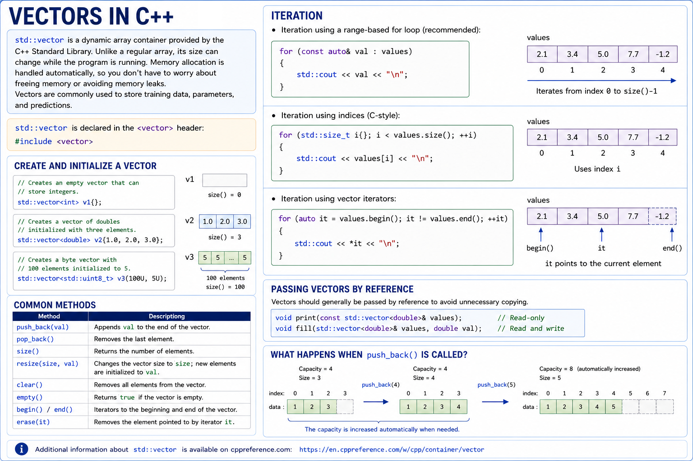
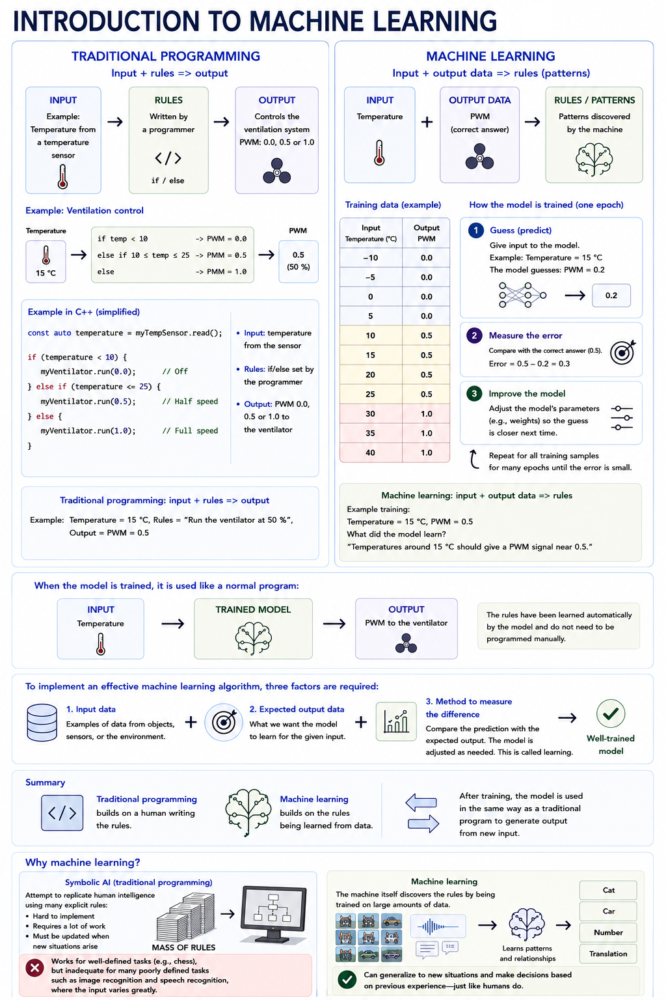
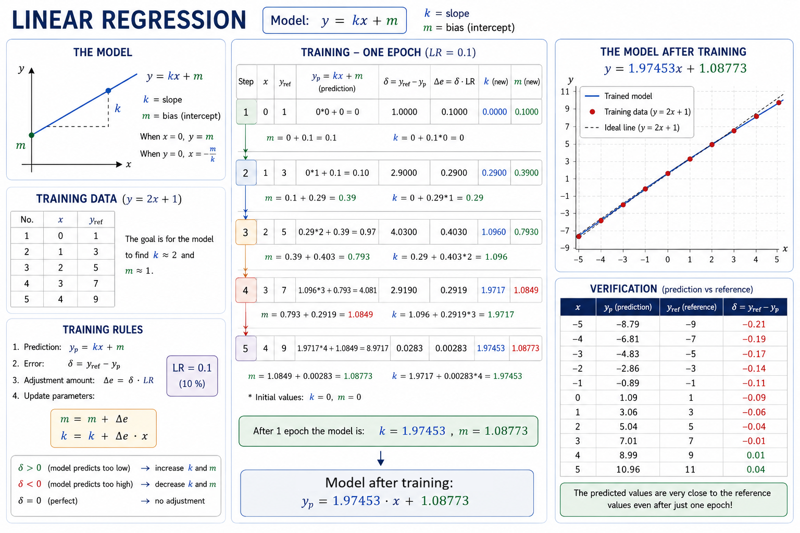
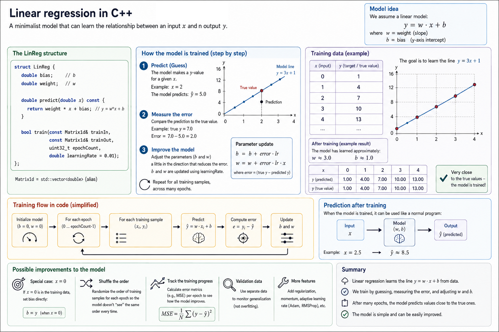

# Appendix A - Theory
This appendix introduces the concepts needed for this lecture. First up is `std::vector`, used to store training data and parameters, followed by an introduction to machine learning and how it differs from traditional programming. It then covers the theory behind linear regression, a worked hand-training example, and a first C++ implementation.

---

## 1. Vectors in C++


`std::vector` is defined in the `<vector>` header:

```cpp
#include <vector>
```

---

### Creating and initializing a vector
Vectors can be created as shown below:

```cpp
// Creates an empty vector that can store integers.
std::vector<int> v1{};

// Creates a floating-point vector initialized with three elements.
std::vector<double> v2{1.0, 2.0, 3.0};

// Creates a byte vector containing 100 fives.
std::vector<std::uint8_t> v3(100U, 5U);
```

---

### Common methods

| Method | Description |
| :---- | :---------- |
| `push_back(val)` | Adds `val` to the end of the vector |
| `pop_back()` | Removes the last element |
| `size()` | Returns the number of elements |
| `resize(size, val)` | Resizes the vector to `size` elements; new elements are set to `val` |
| `clear()` | Empties the vector |
| `empty()` | Returns `true` if the vector is empty |
| `begin()` / `end()` | Iterators to the beginning/end |
| `erase(it)` | Removes the element at iterator `it` |

### Iteration
* Iteration via range-based for loop (recommended):

```cpp
for (const auto& val : values)
{         
    std::cout << val << "\n";
}
```

* Iteration via index (C-style):

```cpp
for (std::size_t i{}; i < values.size(); ++i) 
{
    std::cout << values[i] << "\n";
}
```

* Iteration via vector iterators:

```cpp
for (auto it = values.begin(); it != values.end(); ++it)
{
    std::cout << *it << "\n";
}
```

### Passing vectors by reference
Vectors should generally be passed by reference to avoid unnecessary copying:

```cpp
void print(const std::vector<double>& values);      // Read-only
void fill(std::vector<double>& values, double val); // Read and write
```

More information on `std::vector` is available at [cppreference.com](https://en.cppreference.com/w/cpp/container/vector).

---

## 2. Introduction to Machine Learning



### Traditional programming
As an example of a traditional program within an embedded system, temperature can be read as input via a temperature sensor, with rules implemented via a conditional statement to control a ventilation system based on the current room temperature. Below is an example of what a method implementing this could look like in C++, for a method `runVentilation()` in a fictional class named `HardwareController`:

```cpp
/**
 * @brief Run the PWM controlled ventilation system. 
 */
void HardwareController::runVentilation() noexcept
{
    constexpr std::int8_t lowerTempLimit{10};
    constexpr std::int8_t upperTempLimit{25};

    constexpr double ventilatorOff{0.0};
    constexpr double ventilatorPwm{0.5};
    constexpr double ventilatorOn{1.0};

    // Read the room temperature with the tempsensor.
    const auto temperature = myTempSensor.read();

    // Disable the ventilator if the temperature is below 10 degrees Celsius.
    if (lowerTempLimit > temperature) 
    { 
        myVentilator.run(ventilatorOff);
    }
    // Run the ventilator at 50% if the temperature is between 10 and 25 degrees Celsius.
    else if ((lowerTempLimit <= temperature) && (upperTempLimit >= temperature)) 
    { 
        myVentilator.run(ventilatorPwm); 
    }
    // Run the ventilator at 100% if the temperature exceeds 25 degrees Celsius.
    else
    {
        myVentilator.run(ventilatorOn);
    }
}
```

---

### Machine learning
For the earlier ventilation control example, we could instead create training sets consisting of various temperatures as input and the values `0.0`, `0.5`, and `1.0` as output:

| Input | Output |
|--------|--------|
|  -10   |  0.0   |
|  -5    |  0.0   |
|   0    |  0.0   |
|   5    |  0.0   |
|   10   |  0.5   |
|   15   |  0.5   |
|   20   |  0.5   |
|   25   |  0.5   |
|   30   |  1.0   |
|   35   |  1.0   |
|   40   |  1.0   |

---

### Why machine learning?
Mimicking human intelligence with a traditional program would require an enormous number of conditional statements to cover every conceivable decision and combination of conditions, which isn't practically feasible. This approach is called *symbolic AI* and was the dominant paradigm in artificial intelligence before machine learning became widespread. It worked well for complex but well-defined tasks (e.g. chess), but was inadequate for less well-defined tasks such as computer vision, speech recognition, and language translation, where the input can vary widely. Machine learning solves this by letting the machine find the rules itself through training on large amounts of data — see the figure above for a comparison.

---

## 3. Linear Regression
One of the most common algorithms in machine learning is linear regression, which in practice means training the machine to detect a linear pattern between input x and output y. From this pattern, a straight line can be derived using the following first-degree equation:

$$y = kx + m,$$

where k is the slope of the line and m is the line's resting value (the value of output y when input x equals zero).

---

### Weight and bias
In machine learning, the terms **weight** and **bias** are often used instead of k- and m-value:
1. Input x is said to be multiplied by a weight k.
2. The model's bias m is its resting value, i.e. the output y when input x equals zero.

This is especially true for neural networks, where a so-called node holds a bias (m-value) and one or more weights (k-values). In practice it's the same thing; the node's inputs x are multiplied by weights k, and the sum k * x of these together with the bias m makes up the node's output y.

**Note!** Nodes in neural networks are somewhat more complex than that — the output usually needs to exceed a threshold value for the node to activate. Neural networks are covered later in the course.

---

### Training data
Training the model requires training data in the form of input x and corresponding output y. A pair consisting of one input x and one output y makes up a **training set**. The table below shows an example of five training sets, where the relationship between input x and output y can be described by the formula y = 2x + 1:

| x | y |
|:-:|:-:|
| 0 | 1 |
| 1 | 3 |
| 2 | 5 |
| 3 | 7 |
| 4 | 9 |

The training data should contain several different training sets, i.e. several pairs of input x and output y. During training, all training sets can be used to train the model over multiple rounds, preferably in random order so the model doesn't become too familiar with the training data. The number of rounds the training data is used to train the model is called **epochs**.

During training, the predicted output $y_p$ should then be compared against the corresponding reference value from the training data $y_{ref}$. The difference between these makes up the deviation δ:

$$\delta = y_{ref} - y_p,$$

where δ is the deviation between reference value $y_{ref}$ and predicted output $y_p$.

The goal is for the deviation δ to end up as close to zero as possible, since that's when the model performs best:

$$\delta = 0 \Rightarrow the\ model\ performs\ excellently$$

If the deviation δ is positive, the predicted value $y_p$ is too low, meaning the model's k- and m-value should be increased:

$$\delta > 0 \Rightarrow k\ and\ m\ should\ be\ increased$$

Likewise, if the deviation δ is negative, the predicted value $y_p$ is too high, meaning the model's k- and m-value should be decreased:

$$\delta < 0 \Rightarrow k\ and\ m\ should\ be\ decreased$$

When there's a deviation, the model's k- and m-value should be adjusted by a certain adjustment amount Δe, which is a factor of the deviation δ as follows:

$$\Delta e = \delta * LR,$$

where LR is the learning rate, which should be adjusted based on how well the model performs. The higher the learning rate, the more strongly the k- and m-value are adjusted on deviation. Too high a learning rate can, however, cause too large an adjustment per k- and m-value. As a starting point, LR can be set to around 1%, which corresponds to 0.01 in the calculations. This value should then be tuned together with the number of epochs (the number of training rounds over the current set of training sets).

The model's m-value should be increased by the adjustment amount Δe:

$$m = m + \Delta e$$

The model's k-value should be increased by the adjustment amount Δe multiplied by the current input x. This means that when x equals zero — when only the m-value determines output y — the k-value isn't adjusted on deviation, only the m-value. At the same time, the higher the x-value, the more the k-value is adjusted for the given input x:

$$k = k + \Delta e * x$$

---

### Training a regression model by hand
A regression model is to be trained using the five training sets defined by the formula y = 2x + 1:

| x | y |
|:-:|:-:|
| 0 | 1 |
| 1 | 3 |
| 2 | 5 |
| 3 | 7 |
| 4 | 9 |

Assume the model's bias (m-value) and weight (k-value) are zero at the start:

$$\begin{cases} k = 0 \\ m = 0 \end{cases}$$

Run training for one epoch with a learning rate `LR` of 10%:

$$LR = 0.1$$

Then perform prediction for input consisting of all integers in the range [-5, 5].

---

### Solution
The figure below demonstrates the training process:



All calculations are shown below.

We run training for each training set one at a time.

#### Training set 1
From the first training set we get input $x = 0$ and reference value $y_{ref}$ = 1:

$$\begin{cases} x = 0 \\ y_{ref} = 1 \end{cases}$$

Since the model's parameters are zero at the start, the predicted output $y_p$ is zero:

$$y_p = k * x + m = 0 * 0 + 0 = 0$$

The deviation $δ$ is therefore one:

$$\delta = y_{ref} - y_p = 1 - 0 = 1$$

For a learning rate $LR$ of 10%, the adjustment amount $Δe$ is 0.1:

$$\Delta e = \delta * LR = 1 * 0.1 = 0.1$$

The model's m-value is increased directly by the adjustment amount $Δe$:

$$m = m + \Delta e = 0 + 0.1 = 0.1$$

The model's k-value is increased by $Δe$ multiplied by x, which when $x = 0$ results in no change:

$$k = k + \Delta e * x = 0 + 0.1 * 0 = 0$$

After the first round of training:

$$\begin{cases} k = 0 \\ m = 0.1 \end{cases}$$

#### Training set 2
$$\begin{cases} x = 1 \\ y_{ref} = 3 \end{cases}$$

$$y_p = k * x + m = 0 * 1 + 0.1 = 0.1$$

$$\delta = y_{ref} - y_p = 3 - 0.1 = 2.9$$

$$\Delta e = \delta * LR = 2.9 * 0.1 = 0.29$$

$$m = m + \Delta e = 0.1 + 0.29 = 0.39$$

$$k = k + \Delta e * x = 0 + 0.29 * 1 = 0.29$$

After the second round of training:

$$\begin{cases} k = 0.29 \\ m = 0.39 \end{cases}$$

#### Training set 3
$$\begin{cases} x = 2 \\ y_{ref} = 5 \end{cases}$$

$$y_p = k * x + m = 0.29 * 2 + 0.39 = 0.97$$

$$\delta = y_{ref} - y_p = 5 - 0.97 = 4.03$$

$$\Delta e = \delta * LR = 4.03 * 0.1 = 0.403$$

$$m = m + \Delta e = 0.39 + 0.403 = 0.793$$

$$k = k + \Delta e * x = 0.29 + 0.403 * 2 = 1.096$$

After the third round of training:

$$\begin{cases} k = 1.096 \\ m = 0.793 \end{cases}$$

Notice the parameters are starting to approach the desired values (k = 2, m = 1).

#### Training set 4
$$\begin{cases} x = 3 \\ y_{ref} = 7 \end{cases}$$

$$y_p = k * x + m = 1.096 * 3 + 0.793 = 4.081$$

$$\delta = y_{ref} - y_p = 7 - 4.081 = 2.919$$

Notice the deviation $δ$ has now started decreasing for the first time.

$$\Delta e = \delta * LR = 2.919 * 0.1 = 0.2919$$

$$m = m + \Delta e = 0.793 + 0.2919 = 1.0849$$

$$k = k + \Delta e * x = 1.096 + 0.2919 * 3 = 1.9717$$

After the fourth round of training:

$$\begin{cases} k = 1.9717 \\ m = 1.0849 \end{cases}$$

Notice the parameters are very close to the desired values (k = 2, m = 1).

#### Training set 5
$$\begin{cases} x = 4 \\ y_{ref} = 9 \end{cases}$$

$$y_p = k * x + m = 1.9717 * 4 + 1.0849 = 8.9717$$

$$\delta = y_{ref} - y_p = 9 - 8.9717 = 0.0283$$

$$\Delta e = \delta * LR = 0.0283 * 0.1 = 0.00283$$

$$m = m + \Delta e = 1.0849 + 0.00283 = 1.08773$$

$$k = k + \Delta e * x = 1.9717 + 0.00283 * 4 = 1.98302$$

After the fifth round of training:

$$\begin{cases} k = 1.98302 \\ m = 1.08773 \end{cases}$$

Notice that after just one epoch, the regression model's parameters have already landed very close to the desired values (k = 2, m = 1). Normally, many more epochs are run, e.g. 1,000-10,000. At the same time, the learning rate tends to be lower, resulting in smaller parameter adjustments per epoch.

After training, the regression model predicts according to the following formula:

$$y_p = 1.98302 * x + 1.08773$$

---

### Verification
The table below shows predicted output $y_p$ and reference values ($y_{ref}$) for input $x$ in the range [-5, 5]. Predicted output has been rounded to two decimal places.

| $x$ | $y_p$  | $y_{ref}$ |
|:--:|:------:|:---------:|
| -5 | -8.83  | -9        |
| -4 | -6.84  | -7        |
| -3 | -4.86  | -5        |
| -2 | -2.88  | -3        |
| -1 | -0.90  | -1        |
|  0 |  1.09  |  1        |
|  1 |  3.07  |  3        |
|  2 |  5.05  |  5        |
|  3 |  7.04  |  7        |
|  4 |  9.02  |  9        |
|  5 | 11.00  | 11        |

Notice that the predicted output $y_p$ ends up close to the desired output $y_{ref}$ in every case, after training for just a single epoch!

---

## 4. Linear Regression in C++
Below is a minimal implementation of linear regression in C++ using a struct `LinReg` that:
* Holds the model's parameters `bias` and `weight`.
* Predicts with the method `predict()`.
* Trains with the method `train()`.

**Note!** An alias `Matrix1d` is used as a substitute for `std::vector<double>`.



The full implementation is shown below:

```cpp
/**
 * @brief Minimalistic linear regression example.
 */
#include <algorithm>
#include <cstdint>
#include <cstdio>
#include <exception>
#include <vector>

namespace
{
/** One-dimensional matrix. */
using Matrix1d = std::vector<double>;

/**
 * @brief Linear regression structure.
 */
struct LinReg
{
    /** Bias value. */
    double bias;

    /** Weight value. */
    double weight;

    /**
     * @brief Predict with the given linear regression model.
     * 
     * @param[in] input Input value.
     * 
     * @return The predicted value.
     */
    double predict(const double input) const noexcept { return weight * input + bias; }

    /**
     * @brief Train the given linear regression model with given training sets.
     * 
     * @param[in] trainIn Input values. Size must be greater than 0.
     * @param[in] trainOut Output values. Size must be greater than 0.
     * @param[in] epochCount Number of epochs to train. Must be greater than 0.
     * @param[in] learningRate Learning rate (default = 1 %). Must be in range (0.0, 1.0).
     * 
     * @return True if training was successful, false otherwise.
     */
    bool train(const Matrix1d& trainIn, const Matrix1d& trainOut, 
               const std::uint32_t epochCount, const double learningRate = 0.01) noexcept
    {
        // Check input parameters and training set count, terminate if invalid.
        const auto setCount = static_cast<std::uint32_t>(std::min(trainIn.size(), trainOut.size()));

        if (0U == setCount)
        {
            std::fprintf(stderr, "Invalid training data: no training sets provided!\n");
            std::terminate();
        }
        if (0U == epochCount)
        {
            std::fprintf(stderr, "Invalid epoch count: must train for at least one epoch!\n");
            std::terminate();
        }
        if ((0.0 >= learningRate) || (1.0 <= learningRate))
        {
            std::fprintf(stderr, "Invalid learning rate %g: must be in range (0.0, 1.0)!\n",
                learningRate);
            std::terminate();
        }

        // Train the model for the given number of epochs.
        for (std::uint32_t epoch{}; epoch < epochCount; ++epoch)
        {
            // Iterate through all training sets.
            for (std::uint32_t i{}; i < setCount; ++i)
            {
                const auto input  = trainIn[i];
                const auto output = trainOut[i];
                
                // Perform prediction and calculate the error.
                const auto prediction = predict(input);
                const auto error      = output - prediction;

                // Adjust the parameters in accordance with the error.
                bias   += error * learningRate;
                weight += error * learningRate * input;
            }
        }
        return true;
    }
};
} // namespace

/**
 * @brief Train and predict with a simple linear regression model.
 * 
 * @return 0 on success, -1 on failure.
 */
int main()
{
    constexpr std::uint32_t epochCount{100U};
    constexpr double learningRate{0.1};

    // Create linear regression model to predict y = 3x + 1.
    const Matrix1d trainIn{0.0, 1.0, 2.0, 3.0, 4.0};
    const Matrix1d trainOut{1.0, 4.0, 7.0, 10.0, 13.0};
    LinReg linReg{};

    // Train the model, terminate on failure.
    if (!linReg.train(trainIn, trainOut, epochCount, learningRate))
    {
        std::printf("Training failed!\n");
        return -1;
    }
    // Predict and print result on success.
    for (const auto& input : trainIn)
    {
        const auto prediction = linReg.predict(input);
        std::printf("x = %g, ypred = %g\n", input, prediction);
    }
    return 0;
}
```

The model above is intentionally minimal. It could be extended with, for example:
* A special case for `x = 0`, where the bias is set directly to the reference value (`bias = output`).
* Randomizing the training order to avoid the model becoming too familiar with the training data.
* Computing the mean error per epoch to track the model's training progress.

---
