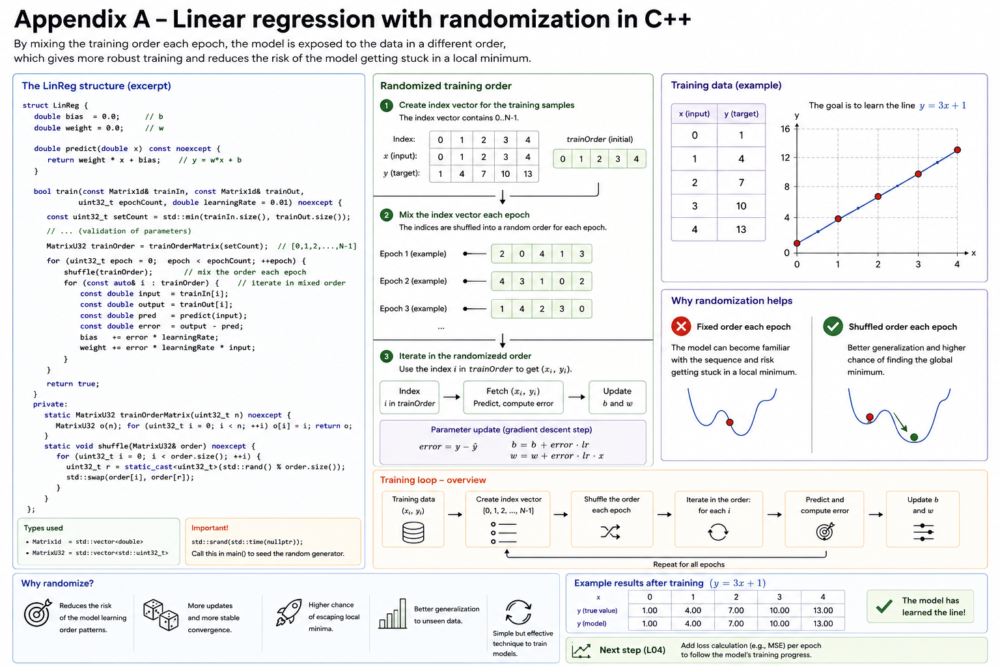
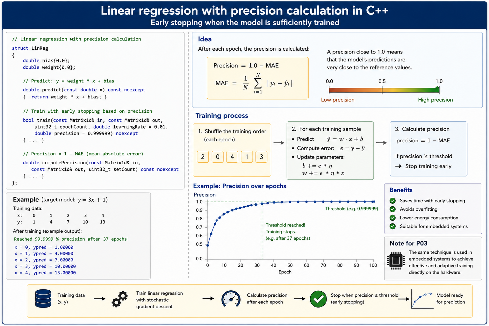

# Appendix A - Theory
This appendix extends the linear regression implementation from **L01** in two ways: first with a randomized training order, then with precision calculation and early stopping.

---

## 1. Randomizing the Training Order
If the model is always trained in the same order, it risks becoming too fitted to that particular sequence; it learns the pattern in the ordering rather than in the data. By shuffling the training order every epoch, the model is exposed to the data in varying order, which produces more robust training and reduces the risk of the model getting stuck in a local minimum.

Below is an extension of the regression struct from **L01** with randomized training order. The struct's `train()` method:
* Creates an index vector for the training sets.
* Shuffles the index vector randomly before each epoch.
* Iterates through the training sets in the randomized order.

**Note!** In addition to `Matrix1d`, the alias `MatrixU32` is used as a substitute for `std::vector<std::uint32_t>`.



The full implementation is shown below:

```cpp
/**
 * @brief Linear regression with randomized training order.
 */
#include <algorithm>
#include <cstdint>
#include <cstdio>
#include <cstdlib>
#include <ctime>
#include <exception>
#include <vector>

namespace
{
/** One-dimensional matrix. */
using Matrix1d = std::vector<double>;

/** Unsigned 32-bit integer matrix. */
using MatrixU32 = std::vector<std::uint32_t>;

/**
 * @brief Linear regression structure.
 */
struct LinReg
{
    /** Bias value. */
    double bias;

    /** Weight value. */
    double weight;

    /**
     * @brief Predict with the given linear regression model.
     * 
     * @param[in] input Input value.
     * 
     * @return The predicted value.
     */
    double predict(const double input) const noexcept { return weight * input + bias; }

    /**
     * @brief Train the given linear regression model with given training sets.
     * 
     * @param[in] trainIn Input values. Size must be greater than 0.
     * @param[in] trainOut Output values. Size must be greater than 0.
     * @param[in] epochCount Number of epochs to train. Must be greater than 0.
     * @param[in] learningRate Learning rate (default = 1 %). Must be in range (0.0, 1.0).
     * 
     * @return True if training was successful, false otherwise.
     */
    bool train(const Matrix1d& trainIn, const Matrix1d& trainOut, 
               const std::uint32_t epochCount, const double learningRate = 0.01) noexcept
    {
        // Check input parameters and training set count, terminate if invalid.
        const auto setCount = static_cast<std::uint32_t>(std::min(trainIn.size(), trainOut.size()));

        if (0U == setCount)
        {
            std::fprintf(stderr, "Invalid training data: no training sets provided!\n");
            std::terminate();
        }
        if (0U == epochCount)
        {
            std::fprintf(stderr, "Invalid epoch count: must train for at least one epoch!\n");
            std::terminate();
        }
        if ((0.0 >= learningRate) || (1.0 <= learningRate))
        {
            std::fprintf(stderr, "Invalid learning rate %g: must be in range (0.0, 1.0)!\n",
                learningRate);
            std::terminate();
        }

        // Create train order matrix.
        MatrixU32 trainOrder{trainOrderMatrix(setCount)};

        // Train the model for the given number of epochs.
        for (std::uint32_t epoch{}; epoch < epochCount; ++epoch)
        {
            // Randomize training order each epoch.
            shuffle(trainOrder);

            // Iterate through all training sets in randomized order.
            for (const auto& i : trainOrder)
            {
                const auto input  = trainIn[i];
                const auto output = trainOut[i];
                
                // Perform prediction and calculate the error.
                const auto prediction = predict(input);
                const auto error      = output - prediction;

                // Adjust the parameters in accordance with the error.
                bias   += error * learningRate;
                weight += error * learningRate * input;
            }
        }
        return true;
    }

private:
     // -----------------------------------------------------------------------------
    static MatrixU32 trainOrderMatrix(const std::uint32_t setCount) noexcept
    {
        MatrixU32 order(setCount);
        for (std::uint32_t i{}; i < order.size(); ++i) { order[i] = i; }
        return order;
    }

    // -----------------------------------------------------------------------------
    static void shuffle(MatrixU32& order) noexcept
    {
        for (std::uint32_t i{}; i < order.size(); ++i)
        {
            // Swap values at index r and i.
            const auto r    = static_cast<std::uint32_t>(std::rand() % order.size());
            const auto temp = order[i];
            order[i]        = order[r];
            order[r]        = temp;
        }
    }
};
} // namespace

/**
 * @brief Train and predict with a simple linear regression model.
 * 
 * @return 0 on success, -1 on failure.
 */
int main()
{
    constexpr std::uint32_t epochCount{100U};
    constexpr double learningRate{0.1};

    // Initialize the random generator.
    std::srand(std::time(nullptr));

    // Create linear regression model to predict y = 3x + 1.
    const Matrix1d trainIn{0.0, 1.0, 2.0, 3.0, 4.0};
    const Matrix1d trainOut{1.0, 4.0, 7.0, 10.0, 13.0};
    LinReg linReg{};

    // Train the model, terminate on failure.
    if (!linReg.train(trainIn, trainOut, epochCount, learningRate))
    {
        std::printf("Training failed!\n");
        return -1;
    }
    // Predict and print result on success.
    for (const auto& input : trainIn)
    {
        const auto prediction = linReg.predict(input);
        std::printf("x = %g, ypred = %g\n", input, prediction);
    }
    return 0;
}
```

The model above builds on **L01** with a randomized training order. The next extension is computing the mean error per epoch to track the model's training progress, covered next.

---

## 2. Precision Calculation
Without precision calculation, the model trains for a fixed number of epochs regardless of how well it's actually performing. By computing the precision after each epoch, training can stop as soon as the model is sufficiently trained, saving time and avoiding unnecessary training.

Precision is computed as `1.0 - MAE`, where MAE (*mean absolute error*) is the average absolute error across all training sets. A precision close to `1.0` means the model predicts very close to the reference values.

Below is an extension of the regression struct from earlier in this appendix with precision calculation. The private method `computePrecision()` computes the precision, and `train()` stops training early once the precision exceeds a given threshold.



The full implementation is shown below:

```cpp
/**
 * @brief Linear regression with precision calculation.
 */
#include <algorithm>
#include <cmath>
#include <cstdint>
#include <cstdio>
#include <cstdlib>
#include <ctime>
#include <exception>
#include <vector>

namespace
{
/** One-dimensional matrix. */
using Matrix1d = std::vector<double>;

/** Unsigned 32-bit integer matrix. */
using MatrixU32 = std::vector<std::uint32_t>;

/**
 * @brief Linear regression structure.
 */
struct LinReg
{
    /** Bias value. */
    double bias;

    /** Weight value. */
    double weight;

    /**
     * @brief Predict with the given linear regression model.
     * 
     * @param[in] input Input value.
     * 
     * @return The predicted value.
     */
    double predict(const double input) const noexcept { return weight * input + bias; }

    /**
     * @brief Train the given linear regression model with given training sets.
     * 
     * @param[in] trainIn    Input values. Size must be greater than 0.
     * @param[in] trainOut   Output values. Size must be greater than 0.
     * @param[in] epochCount Number of epochs to train. Must be greater than 0.
     * @param[in] learningRate Learning rate (default = 1 %). Must be in range (0.0, 1.0).
     * @param[in] precision  Desired precision (default = 99.9999 %). Must be in range (0.0, 1.0).
     * 
     * @return True if training was successful, false otherwise.
     */
    bool train(const Matrix1d& trainIn, const Matrix1d& trainOut, 
               const std::uint32_t epochCount, const double learningRate = 0.01,
               const double precision = 0.999999) noexcept
    {
        // Check input parameters and training set count, terminate if invalid.
        const auto setCount = static_cast<std::uint32_t>(std::min(trainIn.size(), trainOut.size()));
        if (0U == setCount)
        {
            std::fprintf(stderr, "Invalid training data: no training sets provided!\n");
            std::terminate();
        }
        if (0U == epochCount)
        {
            std::fprintf(stderr, "Invalid epoch count: must train for at least one epoch!\n");
            std::terminate();
        }
        if ((0.0 >= learningRate) || (1.0 <= learningRate))
        {
            std::fprintf(stderr, "Invalid learning rate %g: must be in range (0.0, 1.0)!\n",
                learningRate);
            std::terminate();
        }
        if ((0.0 >= precision) || (1.0 <= precision))
        {
            std::fprintf(stderr, "Invalid precision %g: must be in range (0.0, 1.0)!\n",
                precision);
            std::terminate();
        }

        // Create train order matrix.
        MatrixU32 trainOrder{trainOrderMatrix(setCount)};

        // Train the model for the given number of epochs.
        for (std::uint32_t epoch{}; epoch < epochCount; ++epoch)
        {
            // Randomize training order each epoch.
            shuffle(trainOrder);

            // Iterate through all training sets in randomized order.
            for (const auto& i : trainOrder)
            {
                const auto input  = trainIn[i];
                const auto output = trainOut[i];
                
                // Perform prediction and calculate the error.
                const auto prediction = predict(input);
                const auto error      = output - prediction;

                // Adjust the parameters in accordance with the error.
                bias   += error * learningRate;
                weight += error * learningRate * input;
            }

            // Calculate the precision, return true if exceeded.
            const auto currentPrecision = computePrecision(trainIn, trainOut, setCount);
            if (currentPrecision >= precision)
            { 
                const auto percent = currentPrecision * 100.0;
                std::printf("Reached %g %% precision after %u epochs!\n", percent, epoch);
                return true;
            }
        }
        return true;
    }

private:
    static MatrixU32 trainOrderMatrix(const std::uint32_t setCount) noexcept
    {
        MatrixU32 order(setCount);
        for (std::uint32_t i{}; i < order.size(); ++i) { order[i] = i; }
        return order;
    }

    static void shuffle(MatrixU32& order) noexcept
    {
        for (std::uint32_t i{}; i < order.size(); ++i)
        {
            // Swap values at index r and i.
            const auto r    = static_cast<std::uint32_t>(std::rand() % order.size());
            const auto temp = order[i];
            order[i]        = order[r];
            order[r]        = temp;
        }
    }

    double computePrecision(const Matrix1d& trainIn, const Matrix1d& trainOut,
                            const std::uint32_t setCount) const noexcept
    {
        double totalError{};
        for (std::uint32_t i{}; i < setCount; ++i)
        {
            const auto input      = trainIn[i];
            const auto output     = trainOut[i];
            const auto prediction = predict(input);
            const auto error      = output - prediction;

            totalError += std::abs(error);
        }
        const auto avgError = totalError / setCount;
        return 1.0 - avgError;
    }
};
} // namespace

/**
 * @brief Train and predict with a simple linear regression model.
 * 
 * @return 0 on success, -1 on failure.
 */
int main()
{
    constexpr std::uint32_t epochCount{100U};
    constexpr double learningRate{0.1};

    // Initialize the random generator.
    std::srand(std::time(nullptr));

    // Create linear regression model to predict y = 3x + 1.
    const Matrix1d trainIn{0.0, 1.0, 2.0, 3.0, 4.0};
    const Matrix1d trainOut{1.0, 4.0, 7.0, 10.0, 13.0};
    LinReg linReg{};

    // Train the model, terminate on failure.
    if (!linReg.train(trainIn, trainOut, epochCount, learningRate))
    {
        std::printf("Training failed!\n");
        return -1;
    }
    // Predict and print result on success.
    for (const auto& input : trainIn)
    {
        const auto prediction = linReg.predict(input);
        std::printf("x = %g, ypred = %g\n", input, prediction);
    }
    return 0;
}
```

The model above builds on the randomized-order version from earlier in this appendix with precision calculation and early stopping. Linear regression is a special case of a single-node neural network; the next step is to see how these same ideas — weights, biases, error-driven adjustment — extend to full neural networks with multiple layers, starting in L03.

---
