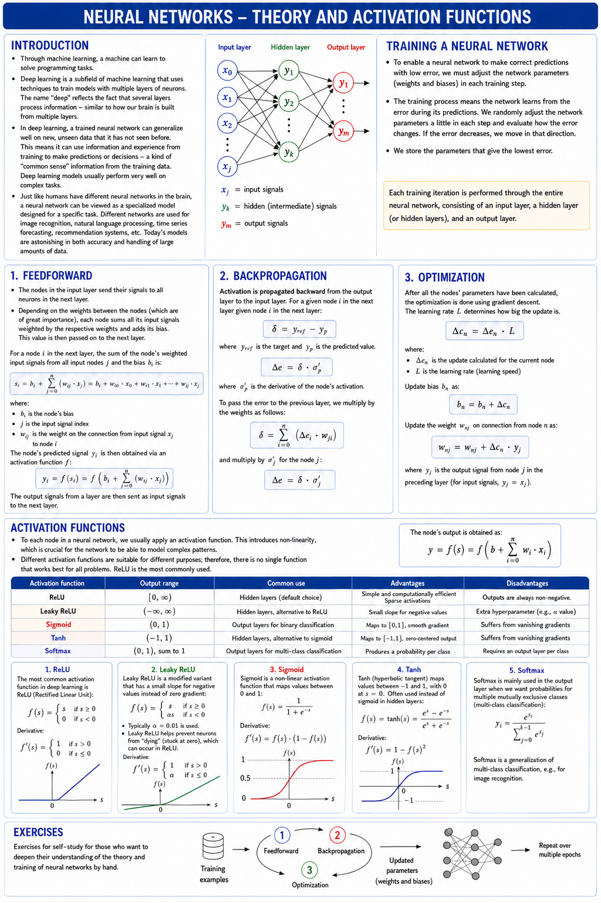

# Appendix A - Theory
This appendix covers neural network theory — feedforward, backpropagation, optimization, and
activation functions — followed by the architecture of the dense layer interface you'll build this
lecture and the next.

---

## 1. Neural Networks

### Introduction
* Through machine learning, a given machine can become capable of learning rules without having been explicitly programmed to do so.
* **Deep learning** is a subfield of machine learning and involves techniques that vaguely resemble how our brains work. The name stems from the fact that the technique was originally inspired by how our brains function. In practice, though, brains and neural networks work very differently.
* Deep learning uses so-called **neural networks** containing several steps, or layers, between input and output — often hundreds — which allows relevant information to be extracted from the input while irrelevant information is discarded. This makes deep learning well suited to images and similar data containing a large amount of information, most of which is usually insignificant.
* The more layers used in a neural network, the deeper the model. Information can be thought of as passing through and being processed by different filters that distill the information. In each layer, a certain type of irrelevant data is filtered out while relevant data is retained. Step by step, the input changes from its original form and increasingly contains information about the output.



---

### Theory Behind Training a Neural Network
* For a neural network to predict with low deviation, the network must be trained so that the parameters (weights and biases) of its nodes are adjusted to suitable values.
* Existing training sets are therefore used to train the network for a certain number of epochs. At each epoch, the order of the training sets is randomized so the network doesn't get used to any patterns arising from the particular order the training sets happen to be stored in.

The following steps are performed for each training set, for a simple neural network consisting of an input layer, a hidden layer, and an output layer.

#### 1. Feedforward
* The nodes in the input layer form the inputs x to every neuron in the hidden layer.
* Since these inputs x carry different degrees of importance, also called weight, each is multiplied by its own weight w in the hidden layer. These weights should be randomly chosen at the start, and then adjusted during training.

For each node in the hidden layer, the contribution w * x from each input x from the input layer is summed together with the node's resting point / bias b into a sum s:

$$s = b + \sum_{i=0}^{j} w_i * x_i = b + w_0 * x_0 + w_1 * x_1 \ldots + w_j * x_j,$$

where:
* $b$ is the node's bias
* $j$ is the number of inputs
* $w_i * x_i$ is the product of each weight $w$ and its connected input $x$

The node's predicted output $y_p$ is obtained via an activation function σ:

$$y_p = \sigma(s) = \sigma\!\left(b + \sum_{i=0}^{j} w_i * x_i\right)$$

The outputs from the hidden layer then form the inputs to the output layer, where the same principle applies.

#### 2. Backpropagation
The deviation for each node's output is computed starting from the output layer and moving backward to the hidden layer. For a given node n in the output layer:

$$\delta = y_{ref} - y_p$$

The computed error Δe for a given node n in the output layer:

$$\Delta e = \delta * y_p'$$

where $y_p'$ is the derivative of the node's predicted output.

For a given node n in a given hidden layer, the deviation δ is computed as:

$$\delta = \sum_{i=0}^{j} [\Delta e_i * w_i]$$

and the computed error Δe for the node:

$$\Delta e = \delta * y_p'$$

#### 3. Optimization
Once the error for the nodes' parameters has been computed, optimization is performed via a gradient algorithm. The rate of change Δc_n for a given node n:

$$\Delta c_n = \Delta e_n * L$$

where:
* $\Delta e_n$ is the computed error for the current node
* $L$ is the learning rate

The node's bias $b_n$ is updated:

$$b_n = b_n + \Delta c_n$$

Each weight $w_j$ connected to node n is updated:

$$w_j = w_j + \Delta c_n * y_j$$

where $y_j$ is the output from the connected node j in the previous layer (for the input layer, $y_j = x_j$).

---

### Activation Functions
* Some type of activation function is typically used for each node in the hidden and output layers. This introduces non-linearity into the network, which is required to model anything beyond simple linear relationships.
* Some activation functions (e.g. sigmoid, tanh, and softmax) also keep the output within a certain range, while others (e.g. ReLU) are unbounded above.

| Activation function | Output range | Typical use | Main drawback |
|---|---|---|---|
| ReLU | $[0, \infty)$ | Hidden layers (default choice) | Can "die" on negative inputs |
| Leaky ReLU | $(-\infty, \infty)$ | Hidden layers, alternative to ReLU | Extra hyperparameter (k) to choose |
| Sigmoid | $(0, 1)$ | Output layer for binary classification | Saturates at large \|s\|, gives small gradients |
| Tanh | $(-1, 1)$ | Hidden layers, zero-centered output | Saturates at large \|s\|, gives small gradients |
| Softmax | $(0, 1)$, sums to 1 | Output layer for multi-class classification | Requires one output node per class |

The node's output y is obtained as:

$$y = \sigma(s) = \sigma\!\left(b + \sum_{i=0}^{j} w_i * x_i\right)$$

#### 1. ReLU
The most common activation function in deep learning is **ReLU** *(Rectified Linear Unit)*:

$$\begin{cases} s \geq 0 \Rightarrow y = s \\ s < 0 \Rightarrow y = 0 \end{cases}$$

As a rule of thumb, ReLU tends to be the most suitable activation function to implement when there's no clear-cut answer.

**Leaky ReLU** is an improved variant where signals below zero are retained as a weak signal:

$$\begin{cases} s \geq 0 \Rightarrow y = s \\ s < 0 \Rightarrow y = s * k \end{cases}$$

* As a rule of thumb, k = 0.01 can be used.
* Leaky ReLU counteracts neurons "dying" (getting stuck at zero), which can otherwise cause the model to train poorly.

The derivative of ReLU:

$$\begin{cases} y > 0 \Rightarrow dy = 1 \\ y \leq 0 \Rightarrow dy = 0 \end{cases}$$

#### 2. Sigmoid
Sigmoid is a common activation function when only two classes are used, where the output is set to a number between 0 and 1:

$$y = \frac{1}{1 + e^{-s}}$$

The derivative:

$$dy = y * (1 - y)$$

#### 3. Tanh
Tanh *(hyperbolic tangent)* resembles sigmoid but produces an output between -1 and 1, which often leads to faster learning since the outputs become zero-centered:

$$y = \tanh(s) = \frac{e^s - e^{-s}}{e^s + e^{-s}}$$

The derivative:

$$dy = 1 - y^2$$

#### 4. Softmax
Softmax is a common activation function in the output layer, where the sum of all output probabilities equals one. The output y for a node in a layer of j nodes:

$$y = \frac{e^s}{\sum_{i=0}^{j} e^{s_i}}$$

Softmax is particularly useful for multi-class classification, e.g. image recognition.

---

## 2. Dense Layer Architecture

### Overview
Starting this lecture, you'll build up a small neural network in C++ step by step, over this
lecture and the next. The first piece is a `dense_layer::Interface` and a placeholder
implementation of it, `dense_layer::Stub`:

```
ml::dense_layer::Interface   (Interface for a dense layer)
└── ml::dense_layer::Stub    (Dense layer stub)
```

Next lecture, this interface will be used by a `neural_network::Shallow` class to build a small
working (if not yet properly trained) network. The lecture after that (**L05**) replaces `Stub`
with a real, trainable implementation — the interface stays the same throughout, so nothing that
depends on it needs to change when that happens.

---

### The Dense Layer's Interface
`ml::dense_layer::Interface` defines the contract every dense layer must fulfill:

| Method | Description |
|---|---|
| `nodeCount()` | Number of nodes in the layer |
| `weightCount()` | Number of weights per node |
| `output()` | The layer's outputs after feedforward |
| `error()` | The layer's computed error after backpropagation |
| `weights()` | The layer's weights (2D: node × weight) |
| `feedforward(input)` | Computes outputs from the input |
| `backpropagate(reference)` | Computes error from reference values (output layer) |
| `backpropagate(nextLayer)` | Computes error from the next layer (hidden layer) |
| `optimize(input, learningRate)` | Updates bias and weights |

---

### The Stub Class
`ml::dense_layer::Stub` implements the interface but doesn't do anything meaningful:
* Feedforward always sets the output to a fixed value (e.g. `0.5`).
* Backpropagation and optimization do nothing.

The stub exists so that other code — namely the `Shallow` network class you'll build next
lecture — can be written, compiled, and test-run against a real `dense_layer::Interface` before a
correct implementation exists. A correct implementation follows in **L05**.

---
