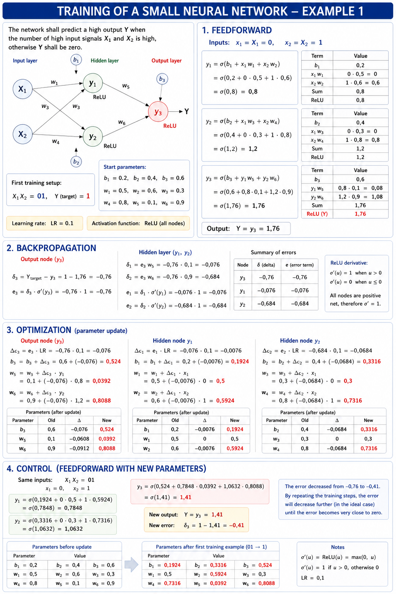
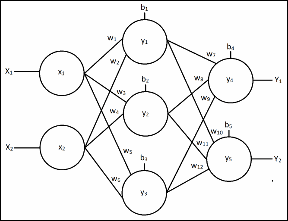
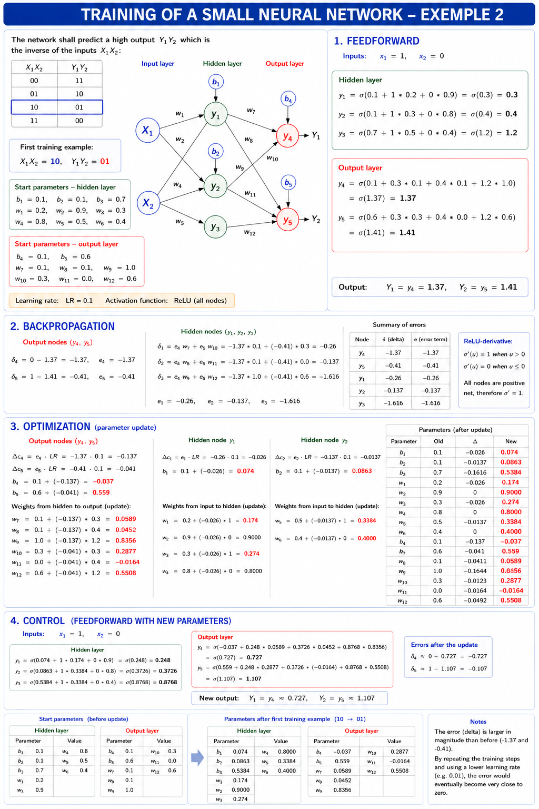
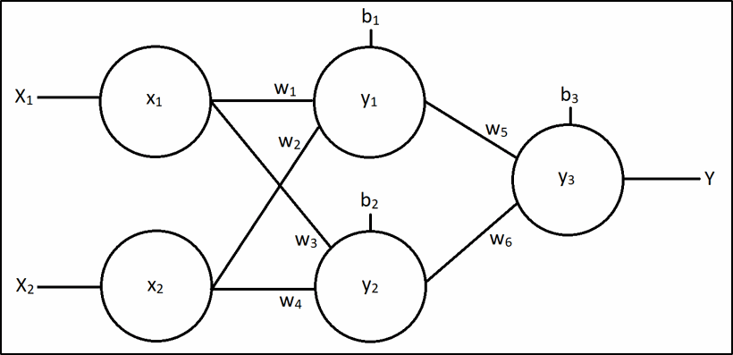
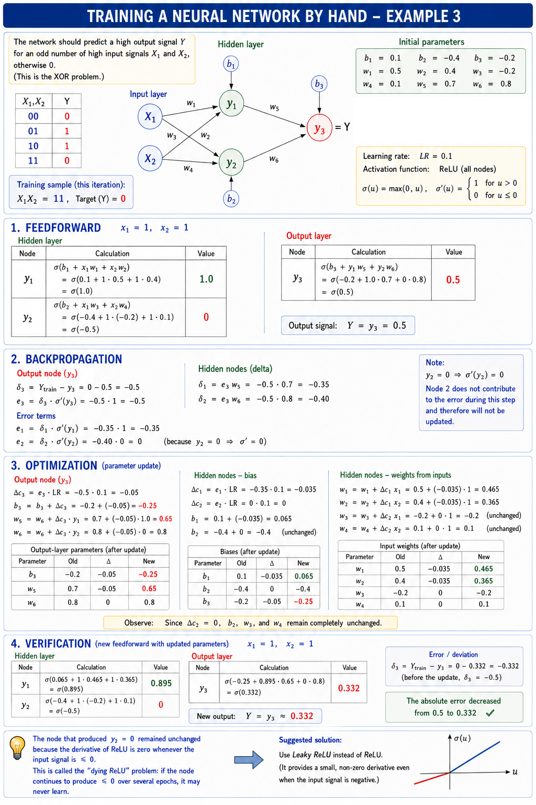

# Appendix B - Exercises

## Hand-Training a Neural Network – Example 1
The neural network below should be trained to predict a high output Y when an odd number of the inputs X1 and X2 are high, and output Y = 0 otherwise:


The first training set: inputs X1X2 = 01, Y = 1.

**Starting parameters:**

```
b1 = 0.2,  b2 = 0.4,  b3 = 0.6
w1 = 0.5,  w2 = 0.6,  w3 = 0.3
w4 = 0.8,  w5 = 0.1,  w6 = 0.9
```

Learning rate: LR = 0.1. Activation function: ReLU for all nodes.

### Solution – Example 1
The figure below demonstrates the training process:



All calculations are shown below.

#### 1. Feedforward

$$x_1 = X_1 = 0, \quad x_2 = X_2 = 1$$

$$y_1 = \sigma(b_1 + x_1 w_1 + x_2 w_2) = \sigma(0.2 + 0 * 0.5 + 1 * 0.6) = \sigma(0.8) = 0.8$$

$$y_2 = \sigma(b_2 + x_1 w_3 + x_2 w_4) = \sigma(0.4 + 0 * 0.3 + 1 * 0.8) = \sigma(1.2) = 1.2$$

$$y_3 = \sigma(b_3 + y_1 w_5 + y_2 w_6) = \sigma(0.6 + 0.8 * 0.1 + 1.2 * 0.9) = \sigma(1.76) = 1.76$$

$$Y = y_3 = 1.76$$

#### 2. Backpropagation

$$\delta_3 = Y_{train} - y_3 = 1 - 1.76 = -0.76$$

$$e_3 = \delta_3 * \sigma'(y_3) = -0.76 * 1 = -0.76$$

$$\delta_1 = e_3 w_5 = -0.76 * 0.1 = -0.076$$

$$\delta_2 = e_3 w_6 = -0.76 * 0.9 = -0.684$$

$$e_1 = \delta_1 * \sigma'(y_1) = -0.076 * 1 = -0.076$$

$$e_2 = \delta_2 * \sigma'(y_2) = -0.684 * 1 = -0.684$$

#### 3. Optimization

$$\Delta c_3 = e_3 * LR = -0.76 * 0.1 = -0.076$$

$$b_3 = b_3 + \Delta c_3 = 0.6 + (-0.076) = 0.524$$

$$w_5 = w_5 + \Delta c_3 * y_1 = 0.1 + (-0.076) * 0.8 = 0.0392$$

$$w_6 = w_6 + \Delta c_3 * y_2 = 0.9 + (-0.076) * 1.2 = 0.8088$$

$$\Delta c_1 = e_1 * LR = -0.076 * 0.1 = -0.0076$$

$$\Delta c_2 = e_2 * LR = -0.684 * 0.1 = -0.0684$$

$$b_1 = 0.2 + (-0.0076) = 0.1924, \quad w_1 = 0.5 + (-0.0076) * 0 = 0.5, \quad w_2 = 0.6 + (-0.0076) * 1 = 0.5924$$

$$b_2 = 0.4 + (-0.0684) = 0.3316, \quad w_3 = 0.3 + (-0.0684) * 0 = 0.3, \quad w_4 = 0.8 + (-0.0684) * 1 = 0.7316$$

#### 4. Verification (via feedforward)

With the new parameters and the same inputs X1X2 = 01:

$$y_1 = \sigma(0.1924 + 0 * 0.5 + 1 * 0.5924) = \sigma(0.7848) = 0.7848$$

$$y_2 = \sigma(0.3316 + 0 * 0.3 + 1 * 0.7316) = \sigma(1.0632) = 1.0632$$

$$y_3 = \sigma(0.524 + 0.7848 * 0.0392 + 1.0632 * 0.8088) = \sigma(1.41) = 1.41$$

$$Y = y_3 \approx 1.41, \quad \delta_3 = 1 - 1.41 = -0.41$$

The deviation decreased from -0.76 to -0.41. With further rounds of training and a lower learning rate (e.g. 0.01), the deviation could be brought much closer to zero.

---

## Hand-Training a Neural Network – Example 2
Consider the neural network below:



The network should be trained to predict outputs Y1Y2 that form the inverse of inputs X1X2:

| X1X2 | Y1Y2 |
|:----:|:----:|
|  00  |  11  |
|  01  |  10  |
|  10  |  01  |
|  11  |  00  |

First training set: X1X2 = 10, Y1Y2 = 01.

**Starting parameters – hidden layer:**

```
b1 = 0.1,  b2 = 0.1,  b3 = 0.7
w1 = 0.2,  w2 = 0.9,  w3 = 0.3
w4 = 0.8,  w5 = 0.5,  w6 = 0.4
```

**Starting parameters – output layer:**

```
b4 = 0.1,  b5 = 0.6
w7  = 0.1,  w8  = 0.1,  w9  = 1.0
w10 = 0.3,  w11 = 0.0,  w12 = 0.6
```

Learning rate: LR = 0.1. Activation function: ReLU for all nodes.

### Solution – Example 2
The figure below demonstrates the training process:



All calculations are shown below.


#### 1. Feedforward

$$x_1 = 1, \quad x_2 = 0$$

$$y_1 = \sigma(0.1 + 1 * 0.2 + 0 * 0.9) = 0.3$$

$$y_2 = \sigma(0.1 + 1 * 0.3 + 0 * 0.8) = 0.4$$

$$y_3 = \sigma(0.7 + 1 * 0.5 + 0 * 0.4) = 1.2$$

$$y_4 = \sigma(0.1 + 0.3 * 0.1 + 0.4 * 0.1 + 1.2 * 1.0) = \sigma(1.37) = 1.37$$

$$y_5 = \sigma(0.6 + 0.3 * 0.3 + 0.4 * 0.0 + 1.2 * 0.6) = \sigma(1.41) = 1.41$$

$$Y_1 = y_4 = 1.37, \quad Y_2 = y_5 = 1.41$$

#### 2. Backpropagation

$$\delta_4 = 0 - 1.37 = -1.37, \quad e_4 = -1.37$$

$$\delta_5 = 1 - 1.41 = -0.41, \quad e_5 = -0.41$$

$$\delta_1 = e_4 w_7 + e_5 w_{10} = -1.37 * 0.1 + (-0.41) * 0.3 = -0.26$$

$$\delta_2 = e_4 w_8 + e_5 w_{11} = -1.37 * 0.1 + (-0.41) * 0.0 = -0.137$$

$$\delta_3 = e_4 w_9 + e_5 w_{12} = -1.37 * 1.0 + (-0.41) * 0.6 = -1.616$$

$$e_1 = -0.26, \quad e_2 = -0.137, \quad e_3 = -1.616$$

#### 3. Optimization

$$\Delta c_4 = -1.37 * 0.1 = -0.137, \quad \Delta c_5 = -0.41 * 0.1 = -0.041$$

$$b_4 = 0.1 + (-0.137) = -0.037, \quad b_5 = 0.6 + (-0.041) = 0.559$$

Output-layer weights (selection):

$$w_7 = 0.1 + (-0.137) * 0.3 = 0.0589, \quad w_9 = 1.0 + (-0.137) * 1.2 = 0.8356$$

$$\Delta c_1 = -0.026, \quad \Delta c_2 = -0.0137, \quad \Delta c_3 = -0.1616$$

Hidden-layer biases:

$$b_1 = 0.074, \quad b_2 = 0.0863, \quad b_3 = 0.5384$$

Hidden-layer weights (selection):

$$w_1 = 0.174, \quad w_3 = 0.2863, \quad w_5 = 0.3384$$

#### 4. Verification (via feedforward)

With the new parameters and X1X2 = 10:

$$y_1 \approx 0.248, \quad y_2 \approx 0.3726, \quad y_3 \approx 0.8768$$

$$Y_1 = y_4 \approx 0.727, \quad Y_2 = y_5 \approx 1.107$$

$$\delta_4 \approx 0 - 0.727 = -0.727, \quad \delta_5 \approx 1 - 1.107 = -0.107$$

The deviations are lower than before (from -1.37 and -0.41). With further rounds of training and a lower learning rate (e.g. 0.01), the deviation could be brought much closer to zero.

---

## Hand-Training a Neural Network – Example 3
Consider the neural network below:



The network should be trained to predict a high output Y when an odd number of the inputs X1 and X2 are high, and output Y = 0 otherwise.

Training has already been carried out for one epoch, and the parameters have the following starting values:

**Starting parameters:**

```
b1 = 0.1,   b2 = -0.4,  b3 = -0.2
w1 = 0.5,   w2 = 0.4,   w3 = -0.2
w4 = 0.1,   w5 = 0.7,   w6 = 0.8
```

Training is now to be carried out with the training set X1X2 = 11, Y = 0.

Learning rate: LR = 0.1. Activation function: ReLU for all nodes.

Perform feedforward, backpropagation, and optimization. Then compute the output again. Did the error decrease? If not, what could you have changed to obtain a smaller error?

### Solution – Example 3
The figure below demonstrates the training process:



All calculations are shown below.

#### 1. Feedforward

$$x_1 = X_1 = 1, \quad x_2 = X_2 = 1$$

$$y_1 = \sigma(b_1 + x_1 w_1 + x_2 w_2) = \sigma(0.1 + 1 * 0.5 + 1 * 0.4) = \sigma(1.0) = 1.0$$

$$y_2 = \sigma(b_2 + x_1 w_3 + x_2 w_4) = \sigma(-0.4 + 1 * (-0.2) + 1 * 0.1) = \sigma(-0.5) = 0$$

$$y_3 = \sigma(b_3 + y_1 w_5 + y_2 w_6) = \sigma(-0.2 + 1.0 * 0.7 + 0 * 0.8) = \sigma(0.5) = 0.5$$

$$Y = y_3 = 0.5$$

#### 2. Backpropagation

$$\delta_3 = Y_{train} - y_3 = 0 - 0.5 = -0.5$$

$$e_3 = \delta_3 * \sigma'(y_3) = -0.5 * 1 = -0.5$$

$$\delta_1 = e_3 w_5 = -0.5 * 0.7 = -0.35$$

$$\delta_2 = e_3 w_6 = -0.5 * 0.8 = -0.4$$

$$e_1 = \delta_1 * \sigma'(y_1) = -0.35 * 1 = -0.35$$

$$e_2 = \delta_2 * \sigma'(y_2) = -0.4 * 0 = 0$$

Note that $y_2 = 0$, which means $\sigma'(y_2) = 0$ since the derivative of ReLU is zero for inputs $\leq 0$. Node 2 therefore doesn't contribute to the error and won't be updated in this step.

#### 3. Optimization

$$\Delta c_3 = e_3 * LR = -0.5 * 0.1 = -0.05$$

$$b_3 = b_3 + \Delta c_3 = -0.2 + (-0.05) = -0.25$$

$$w_5 = w_5 + \Delta c_3 * y_1 = 0.7 + (-0.05) * 1.0 = 0.65$$

$$w_6 = w_6 + \Delta c_3 * y_2 = 0.8 + (-0.05) * 0 = 0.8$$

$$\Delta c_1 = e_1 * LR = -0.35 * 0.1 = -0.035$$

$$\Delta c_2 = e_2 * LR = 0 * 0.1 = 0$$

$$b_1 = 0.1 + (-0.035) = 0.065, \quad w_1 = 0.5 + (-0.035) * 1 = 0.465, \quad w_2 = 0.4 + (-0.035) * 1 = 0.365$$

$$b_2 = -0.4 + 0 = -0.4, \quad w_3 = -0.2 + 0 * 1 = -0.2, \quad w_4 = 0.1 + 0 * 1 = 0.1$$

Since $\Delta c_2 = 0$, $b_2$, $w_3$, and $w_4$ remain completely unchanged.

#### 4. Verification (via feedforward)

With the new parameters and the same inputs X1X2 = 11:

$$y_1 = \sigma(0.065 + 1 * 0.465 + 1 * 0.365) = \sigma(0.895) = 0.895$$

$$y_2 = \sigma(-0.4 + 1 * (-0.2) + 1 * 0.1) = \sigma(-0.5) = 0$$

$$y_3 = \sigma(-0.25 + 0.895 * 0.65 + 0 * 0.8) = \sigma(0.332) = 0.332$$

$$Y = y_3 \approx 0.332, \quad \delta_3 = 0 - 0.332 = -0.332$$

The deviation decreased from -0.5 to -0.332, so the error got smaller. The node that produced $y_2 = 0$, however, remained completely unchanged since the derivative of ReLU is zero where the input is $\leq 0$ — an example of the so-called "dying ReLU" problem. If this kept happening over several consecutive epochs, that node could never be relearned. To counteract this, **Leaky ReLU** could be used instead of ReLU, since it allows a weak signal (and therefore a non-zero derivative) even when the input is negative.

---

## Dense Layer Interface and Stub
You'll start a new `ml` codebase (or extend your existing one, if you'd like to keep the linear
regression code alongside it) with an interface for a dense layer and a placeholder implementation
of it.

---

### 1. Directory structure
Set up the following directory structure:

```
ml/
├── include/
│   └── ml/
│       ├── dense_layer/
│       │   ├── interface.hpp
│       │   └── stub.hpp
│       └── types.hpp
├── source/
│   └── main.cpp
└── Makefile
```

You'll extend this structure further next lecture.

---

### 2. Dense layer interface and stub class
The hidden layer and output layer of a future neural network will be represented by the interface
`ml::dense_layer::Interface`. A concrete implementation isn't created until **L05**. Until then,
you'll implement a simple stub class `ml::dense_layer::Stub` as a placeholder.

**The interface (`ml/dense_layer/interface.hpp`):**
In the namespace `ml::dense_layer`, implement an interface named `Interface`. All methods (except the destructor) should be declared pure virtual (`= 0`).

* **`~Interface()`:** should be set to `default` and marked `virtual` and `noexcept`.

Getters, all `const`, `noexcept`, and `[[nodiscard]]`:

| Method | Returns |
|---|---|
| `nodeCount()` | Number of nodes in the layer (`std::size_t`). |
| `weightCount()` | Number of weights per node (`std::size_t`). |
| `output()` | Reference to the layer's output (read-only floating-point vector). |
| `error()` | Reference to the layer's error (read-only floating-point vector). |
| `weights()` | Reference to the layer's weights (read-only, two-dimensional floating-point vector). |

Computation methods, all `noexcept` and without a return value (`void`). On invalid input (wrong dimensions or an invalid learning rate), an error message should be printed and `std::terminate()` called:

* **`feedforward(input)`:** performs feedforward. `input`: read-only floating-point vector of input data.
* **`backpropagate(output)`** (output layer): computes error from reference values. `output`: read-only floating-point vector of reference values.
* **`backpropagate(nextLayer)`** (hidden layer): computes error from the next layer. `nextLayer`: reference to the next layer (`const Interface&`).
* **`optimize(input, learningRate)`:** updates bias and weights. `input`: read-only floating-point vector. `learningRate`: floating-point number.

**The stub class (`ml/dense_layer/stub.hpp`):**
In the namespace `ml::dense_layer`, implement a subclass named `Stub` that inherits `Interface` via public inheritance. The class should be marked `final`. The stub doesn't perform any real computation — it exists solely so other code can be compiled and test-run against a real `dense_layer::Interface` before a concrete `Dense` implementation exists (see **L05**).

* **`Stub()`:** takes `nodeCount` and `weightCount` (unsigned integers). Initializes the output vector to a fixed value (e.g. `0.5`), and the other vectors (error, bias, weights) to zeros. Should be marked `explicit` and `noexcept`.
* **`~Stub()`:** should be marked `default`, `noexcept`, and `override`.
* Other getters: should be marked `override` (retaining the interface's `const` and `noexcept`, but **not** `[[nodiscard]]`).
* **`feedforward()`**, both overloads of **`backpropagate()`**, and **`optimize()`**: only perform range checks and call `std::terminate()` on mismatch. Should be marked `override` and `noexcept`.

For this class, the default constructor and the copy and move constructors (and corresponding operators) should be deleted.

Add appropriate private member variables to store the number of nodes, the number of weights per node, output, error, bias, and weights.

---

### 3. A quick compile check
There's no network to run yet — that's next lecture, once `neural_network::Shallow` exists to make
use of this interface. For now, just confirm your `Interface`/`Stub` pair compiles: in `main.cpp`,
create a `ml::dense_layer::Stub` with a few nodes and weights, and print its `nodeCount()`,
`weightCount()`, and `output()` to the terminal. You should see `nodeCount()`/`weightCount()`
match what you constructed it with, and every value in `output()` equal to whatever fixed value you
chose (e.g. `0.5`).

---
