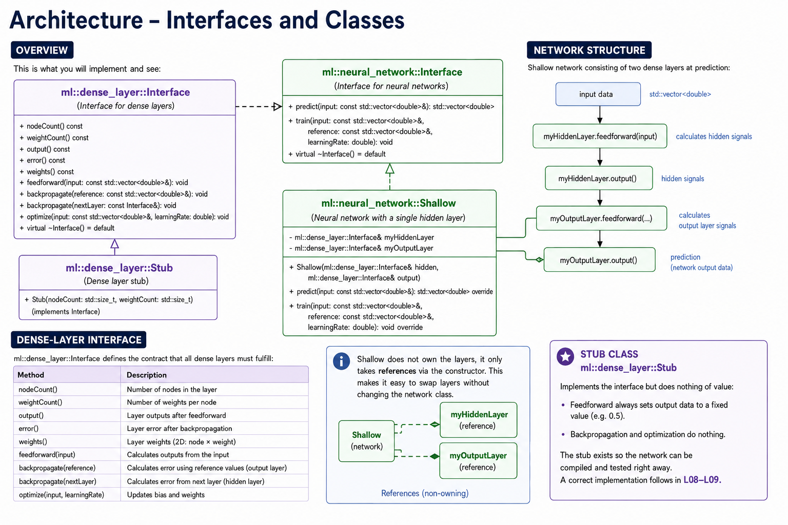
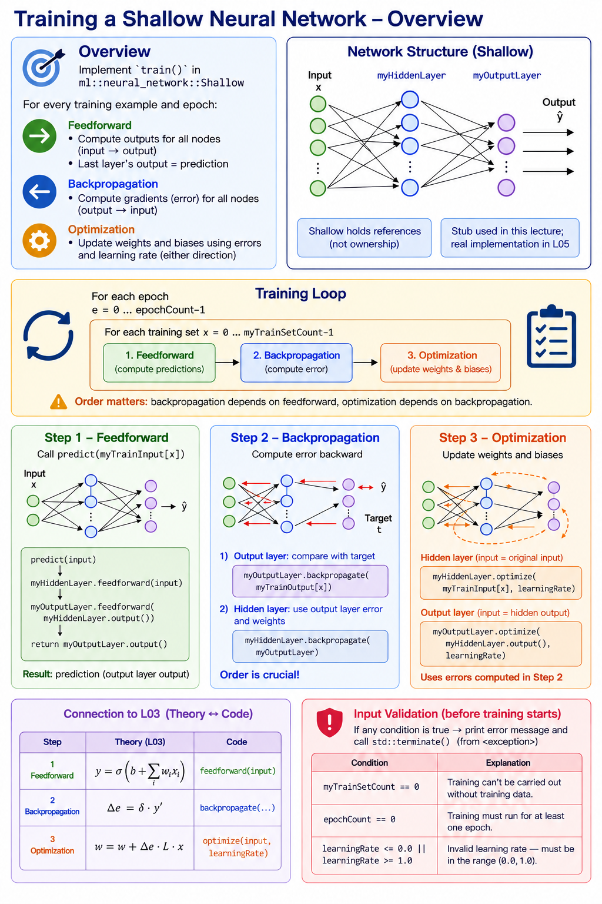

# Appendix A - Theory
This appendix covers the neural network class you'll build this lecture, and how its training loop
maps onto the theory from L03.

---

## 1. Neural Network Architecture



### Overview
Last lecture you built a `dense_layer::Interface` and a placeholder implementation of it,
`dense_layer::Stub`. This lecture adds the piece that actually uses them — a small neural network
class, `neural_network::Shallow` — completing the structure:

```
ml::dense_layer::Interface   (built last lecture)
└── ml::dense_layer::Stub    (built last lecture)

ml::neural_network::Interface   (Interface for neural networks)
└── ml::neural_network::Shallow (Neural network with a single hidden layer)
        ├── ml::dense_layer::Interface& myHiddenLayer
        └── ml::dense_layer::Interface& myOutputLayer
```

`ml::dense_layer::Stub` continues to serve as a placeholder throughout this lecture. Once a
concrete implementation is created in **L05**, the stub is replaced without needing to change any
of the code you write today.

---

### The Network's Structure
`Shallow` holds references to two dense layers and connects them during prediction:

```
input → myHiddenLayer.feedforward(input)
               ↓
       myHiddenLayer.output()
               ↓
       myOutputLayer.feedforward(...)
               ↓
       myOutputLayer.output()  →  prediction
```

`Shallow` doesn't own the layers — it receives them as references via the constructor. This makes it easy to swap out layers without changing the network class, which is exactly what happens in **L05** when the stub is replaced with a real implementation.

---

## 2. Training Loop

### Overview
You'll implement the method `train()` in `ml::neural_network::Shallow`. The method carries out the complete training process, repeated for every training set and epoch:
* Feedforward: 
  * Computes outputs for every node in the network.
  * The output from the last layer forms the network's prediction.
  * Must be computed forward (from input to output).
* Backpropagate: 
  * Computes gradients (simplified error) for every node in the network.
  * Must be computed backward (from output to input).
* Optimization: 
  * Adjusts the trainable parameters (weights and biases) based on the computed error, together with the given learning rate.
  * Computation can happen in either direction.

---

### Structure of the Training Loop



The training loop can be summarized as follows:

```
For each epoch:
    For each training set x:
        1. Feedforward: compute predictions
        2. Backpropagation: compute error
        3. Optimization: update weights and biases
```

The order matters:
* Backpropagation depends on the result of feedforward.
* Optimization depends on the result of backpropagation.

---

### Step 1 – Feedforward
Call `predict(myTrainInput[x])`. This performs feedforward through both layers and returns the output layer's output.

```
predict(input)
  → myHiddenLayer.feedforward(input)
  → myOutputLayer.feedforward(myHiddenLayer.output())
```

---

### Step 2 – Backpropagation
Compute the error backward — always start with the output layer.

**The output layer** compares its output against the reference value:
```
myOutputLayer.backpropagate(myTrainOutput[x])
```

**The hidden layer** computes its error from the output layer's error and weights:
```
myHiddenLayer.backpropagate(myOutputLayer)
```

The order is crucial: the hidden layer's calculation depends on the output layer having already computed its error.

---

### Step 3 – Optimization
Update the weights and biases in both layers using the errors computed in step 2.

```
myHiddenLayer.optimize(myTrainInput[x], learningRate)
myOutputLayer.optimize(myHiddenLayer.output(), learningRate)
```

The hidden layer's input is the original input. The output layer's input is the hidden layer's output (the one computed during feedforward).

---

### Connection to L03
These three steps map directly onto the theory from **L03** (see [appendix A](../../L03/appendix/a_theory.md)):

| Step | Theory (L03) | Code |
|---|---|---|
| Feedforward | $y = \sigma(b + \sum w_i x_i)$ | `feedforward(input)` |
| Backpropagation | $\Delta e = \delta \cdot y'$ | `backpropagate(...)` |
| Optimization | $w = w + \Delta e \cdot L \cdot x$ | `optimize(input, learningRate)` |

---

### Input Validation
Check that training is possible before the training loop starts. Print an error message and call `std::terminate()` (from `<exception>`) immediately if any of the following conditions hold:

| Condition | Explanation |
|---|---|
| `myTrainSetCount == 0` | Training can't be carried out without training data. |
| `epochCount == 0` | Training must run for at least one epoch. |
| `learningRate <= 0.0 \|\| learningRate >= 1.0` | Invalid learning rate — must be in the range `(0.0, 1.0)`. |

---
