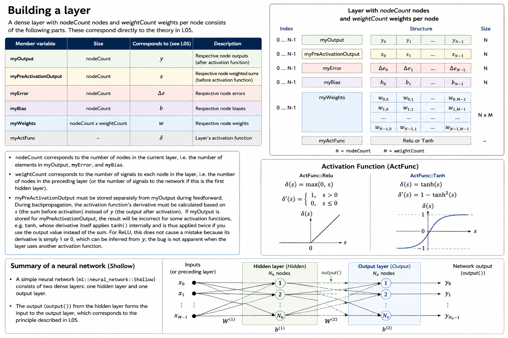
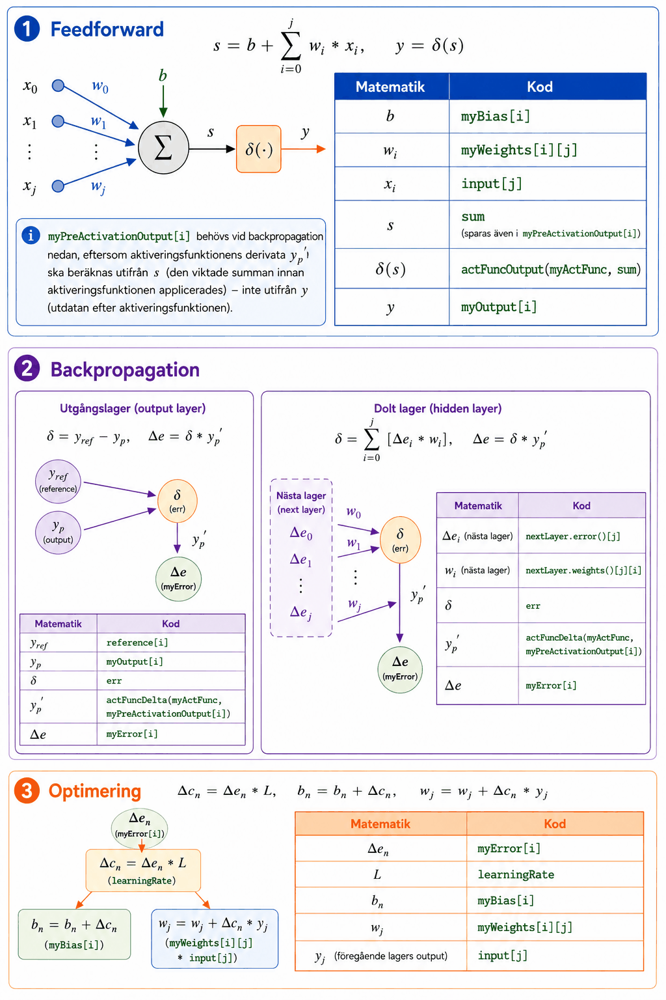

# Appendix A - Theory
This appendix covers the dense layer's architecture and how the feedforward, backpropagation, and
optimization equations from L03 map onto the code you'll write, followed by three extensions:
overfitting and generalization, momentum, and debugging numerical instability.

---

## 1. Dense Layer Architecture

### Introduction
* A **dense layer** *(fully connected layer)* is a layer in a neural network where every node receives all inputs from the previous layer.
* The class `ml::dense_layer::Dense` (see [appendix B](./b_exercises.md)) implements the interface `ml::dense_layer::Interface` and represents such a layer, whether it's used as a hidden layer or output layer in the network.



---

### Structure of a Layer
A dense layer with `nodeCount` nodes and `weightCount` weights per node consists of the parts described below. These map directly onto the theory in **L03** (see [appendix A](../../L03/appendix/a_theory.md)):

| Member variable | Size | Corresponds to (see L03) |
|---|---|---|
| `myOutput` | `nodeCount` | $y$ - each node's output (after the activation function) |
| `myPreActivationOutput` | `nodeCount` | $s$ - each node's weighted sum (before the activation function) |
| `myError` | `nodeCount` | $\Delta e$ - each node's computed error |
| `myBias` | `nodeCount` | $b$ - each node's bias |
| `myWeights` | `nodeCount` x `weightCount` | $w$ - each node's weights |
| `myActFunc` | – | $\sigma$ - the layer's activation function |

---

### Activation Function
Each layer is assigned an activation function of type `ActFunc` (`Relu` or `Tanh`) at construction. The activation function is applied to every node in the layer during feedforward (implemented later this lecture).

---

### Composing a Neural Network
A simple neural network (`ml::neural_network::Shallow`, see **L04**) consists of two dense layers: a hidden layer and an output layer, connected as shown in the figure above.

---

## 2. From Math to Code
This section summarizes how the equations for feedforward, backpropagation, and optimization from
**L03** (see [appendix A](../../L03/appendix/a_theory.md)) map onto the code you write in
`Dense` (see [appendix B](./b_exercises.md) for the full instructions).



---

### Feedforward
$$s = b + \sum_{i=0}^{j} w_i * x_i, \quad y = \sigma(s)$$

| Math | Code |
|---|---|
| $b$ | `myBias[i]` |
| $w_i$ | `myWeights[i][j]` |
| $x_i$ | `input[j]` |
| $s$ | `sum` (also stored in `myPreActivationOutput[i]`, see below) |
| $\sigma(s)$ | `actFuncOutput(myActFunc, sum)` |
| $y$ | `myOutput[i]` |

`myPreActivationOutput[i]` is needed for backpropagation below, since the activation function's
derivative $y_p'$ must be computed from $s$ (the weighted sum before the activation function was
applied), not from $y$ (the output after the activation function).

---

### Backpropagation

**Output layer:**

$$\delta = y_{ref} - y_p, \quad \Delta e = \delta * y_p'$$

| Math | Code |
|---|---|
| $y_{ref}$ | `reference[i]` |
| $y_p$ | `myOutput[i]` |
| $\delta$ | `err` |
| $y_p'$ | `actFuncDelta(myActFunc, myPreActivationOutput[i])` |
| $\Delta e$ | `myError[i]` |

**Hidden layer:**

$$\delta = \sum_{i=0}^{j} [\Delta e_i * w_i], \quad \Delta e = \delta * y_p'$$

| Math | Code |
|---|---|
| $\Delta e_i$ (next layer) | `nextLayer.error()[j]` |
| $w_i$ (next layer) | `nextLayer.weights()[j][i]` |
| $\delta$ | `err` |
| $y_p'$ | `actFuncDelta(myActFunc, myPreActivationOutput[i])` |
| $\Delta e$ | `myError[i]` |

---

### Optimization
$$\Delta c_n = \Delta e_n * L, \quad b_n = b_n + \Delta c_n, \quad w_j = w_j + \Delta c_n * y_j$$

| Math | Code |
|---|---|
| $\Delta e_n$ | `myError[i]` |
| $L$ | `learningRate` |
| $b_n$ | `myBias[i]` |
| $w_j$ | `myWeights[i][j]` |
| $y_j$ (previous layer's output) | `input[j]` |

---

### Helper Functions `initRandom()` and `randomStartVal()`
These don't correspond to any specific equation, but handle the random initialization of weights and biases described in **L03**:
* `initRandom()` ensures the random number generator (`std::rand()`) is seeded exactly once, regardless of how many layers are created.
* `randomStartVal()` generates the actual random number between 0.0 and 1.0 that each bias and weight value is initialized with.

---

## 3. Overfitting and Generalization

### Overview
Every network built so far in this course has been evaluated the same way: train it, then check
its error on the same data it just trained on. That tells you whether the network *learned
something* — but not whether it learned the underlying pattern, or just memorized the specific
training examples. This section covers why that distinction matters; the matching exercise gives
you a hands-on way to observe it with the `Shallow`/`Dense` network you've built across L04-L05.

---

### 1. What Overfitting Is
A model **overfits** when it fits its training data very well but performs poorly on data it
hasn't seen before. Instead of learning the general pattern connecting input to output, it has
partly memorized the specific training examples — including whatever noise or randomness happens
to be in them.

This happens most easily when a network has more capacity (more hidden nodes, and therefore more
weights) than the pattern actually requires, relative to how much training data is available. With
enough parameters and enough training time, a network can drive its training error arbitrarily
close to zero — including on data points that are simply mislabeled or noisy — without that
translating into better predictions on anything else.

---

### 2. Train/Test Split
The only way to tell overfitting apart from real learning is to evaluate the network on data it
never trained on. In practice, the available data is split into:
* A **training set** — used to actually train the network (feedforward, backpropagation,
  optimization), exactly as in every exercise so far.
* A **test set** — held out and never used for training, only for evaluating error afterward.

For the small datasets used in this course, a simple split (e.g. two-thirds training, one-third
test) is enough to illustrate the idea. Production systems often use a third split — a
**validation set** — to tune hyperparameters like learning rate or hidden-layer size without
touching the test set at all, but a single train/test split is sufficient for what you're about to
observe.

---

### 3. The Overfitting Signature
If you track error on both the training set and the test set across epochs, overfitting has a
recognizable shape:
* Training error keeps decreasing, epoch after epoch — the network keeps getting better at
  reproducing exactly what it's already seen.
* Test error decreases at first (the network is learning genuinely useful structure), then
  **plateaus** — further training stops improving, or even hurts, performance on unseen data.

The size of the *gap* between training error and test error is the signal to watch, not the
absolute value of either one on its own. A network with high training error and high test error
close together hasn't learned much yet. A network with near-zero training error and a
persistently much higher test error has overfit.

---

### 4. Mitigations
You've already implemented one overfitting mitigation without necessarily thinking of it that way:
**L02's precision-based early stopping** stops training once a target precision is reached, rather
than always running the full epoch count. Stopping training once test error stops improving (not
just once training error looks good) is the same idea applied more deliberately.

Other standard mitigations are out of scope to implement in this course, but worth knowing by
name: gathering more/more varied training data, **L1/L2 regularization** (penalizing large
weights), and **dropout** (randomly disabling nodes during training so the network can't rely too
heavily on any single one). All three reduce a network's tendency to memorize its training set.

---

## 4. Momentum

### Overview
`optimize()` currently updates every weight and bias using only the current training sample's
gradient. That's plain **stochastic gradient descent (SGD)**. Since this course trains one sample
at a time rather than in batches, each update reacts fully to whatever that single sample happens
to say — including noise — which can make convergence slower and jumpier than it needs to be. This
section covers extending `optimize()` with **momentum**, a small change that often converges
noticeably faster on exactly this kind of noisy, per-sample training; the matching exercise has you
implement it.

---

### 1. The Problem with Plain SGD
Every call to `optimize()` computes an adjustment amount `Δc` for each weight and bias, using only
the error from the current sample, and applies it immediately:

```
Δc = error * learningRate
weight = weight + Δc * input
```

If two consecutive samples disagree about which direction a weight should move — which happens
constantly with small, noisy datasets — the weight zig-zags instead of making steady progress. The
overall direction the loss surface is sloping in gets diluted by per-sample noise.

---

### 2. Momentum
Momentum keeps a **velocity** — an exponentially-weighted running average of past update
amounts — for every weight and bias, and applies the velocity instead of the raw per-step `Δc`:

```
v = β * v + Δc
weight = weight + v
```

where `β` (beta) is the momentum coefficient, typically around `0.9`. Updates that keep pointing
in a consistent direction accumulate in `v` and the effective step size grows; updates that
oscillate back and forth partially cancel out in the running average. The net effect is usually
smoother, faster convergence than plain SGD, particularly for the noisy per-sample updates this
course already uses.

---

### 3. Beyond Momentum: Adam
Momentum is one axis of improvement — the *direction* of updates gets smoothed. **Adam** (Adaptive
Moment Estimation) extends this further by also giving every parameter its own adaptive learning
rate, based on a running estimate of how large that parameter's gradients have typically been. It's
one of the most widely used optimizers in practice, and it's a fairly direct extension of the
momentum idea implemented here — but a full implementation is out of scope for this course. Worth
knowing the name for when you encounter it elsewhere.

---

### 4. A Word of Caution
Momentum doesn't come for free: a high `β` combined with too high a learning rate can cause updates
to accumulate *too* enthusiastically and overshoot past a good solution instead of converging to
one — the same instability discussed in more detail later in this appendix. If a momentum-enabled
network trains worse than the plain-SGD version, try lowering the learning rate before assuming
momentum itself is the problem.

---

## 5. Debugging Numerical Instability

### Overview
L05 is the first point in this course where `feedforward()`, `backpropagate()`, and `optimize()`
run real math instead of stub values — which also makes it the first point where a bug or a bad
hyperparameter can produce genuinely broken training instead of just "not implemented yet." This
section covers what that actually looks like with the network you've built and how to recognize
it; the matching exercise walks through a habit that catches most of these bugs before they cost
you an afternoon.

---

### 1. What "Broken Training" Actually Looks Like Here
A lot of deep learning material warns about gradients "exploding to NaN or infinity." With the
bounded activation functions used in this course, that's not usually what you'll see. `Tanh`'s
output is mathematically confined to `(-1, 1)` and `std::tanh()` handles large inputs gracefully
without overflowing — so instead of exploding, a `Tanh` network that's given too aggressive a
learning rate tends to **saturate**: weights swing to extreme values, `Tanh`'s output gets pinned
near `±1`, and its derivative (`1 - y²`) collapses toward zero. Once that happens, `myError`
collapses too, and training silently stalls — precision stops changing epoch after epoch, not
because the network converged, but because it can no longer compute a useful gradient.

`Relu` fails even more abruptly: since `Relu`'s derivative is exactly `0` for any non-positive
input, a single too-large update can push every hidden node's pre-activation negative in one
shot — this is the "dying ReLU" problem from **L03**, and it can happen from a bad learning rate
just as easily as from bad luck during random initialization. Once every node is dead, no further
epoch changes anything, because there's no gradient left to propagate.

The common thread: with this course's activation functions, a numerically unstable network usually
doesn't crash or print `nan` — it goes quiet. Precision stops improving and stays exactly flat,
often starting from a very early epoch. That flatness *is* the failure signal.

---

### 2. The More Likely Culprit: Your Math, Not Your Hyperparameters
Before turning down the learning rate, check the implementation itself. In a network this small, a
sign error or a missing term in a hand-written `backpropagate()` is a far more common cause of a
stalled or nonsensical network than a genuinely too-aggressive learning rate. Common mistakes worth
checking against this appendix's **From Math to Code** section above:
* Using `myOutput[i]` instead of `myPreActivationOutput[i]` when calling `actFuncDelta()` — the
  derivative needs the pre-activation sum, not the post-activation output.
* Swapping the order of terms in `err = reference[i] - myOutput[i]` (this matters — it flips the
  sign of every gradient that follows).
* Forgetting to accumulate over `nextLayer.nodeCount()` when computing a hidden layer's error, and
  only using one of the next layer's nodes instead of summing across all of them.

---

### 3. A Sanity-Check Habit
Before trusting a new implementation on a real dataset, run it on the smallest possible case first:
one or two training samples, a handful of epochs, and print the output after each step. Compare
what you see against a hand-computed feedforward and backpropagation step, the same way the
worked examples in **L03** and this appendix's **From Math to Code** section were computed by hand.
If your code's numbers don't match a manual calculation on a tiny example, they won't magically
start matching on a larger one — it's much cheaper to find that out on two training samples than on
twenty.

---

### 4. A Note on Genuine Overflow
Bounded activation functions don't make numerical overflow impossible everywhere — they just make
it unlikely with the specific architecture and functions used in this course. It becomes a real risk
if you ever implement an activation function using its raw formula instead of a numerically-aware
library function — e.g. computing sigmoid as `1.0 / (1.0 + std::exp(-s))` directly. For a
sufficiently negative `s`, `std::exp(-s)` can overflow to `inf` before the division ever happens,
even though the true sigmoid value is a perfectly well-behaved number close to `0`. The same risk
applies to softmax (introduced in **L03** but not implemented in this course): exponentiating every
raw score before normalizing can overflow for large scores. The standard fix in both cases is
algebraic, not a smaller learning rate: subtract the maximum value in the layer from every score
before exponentiating. This doesn't change the mathematical result, but it keeps every intermediate
value bounded.

---
