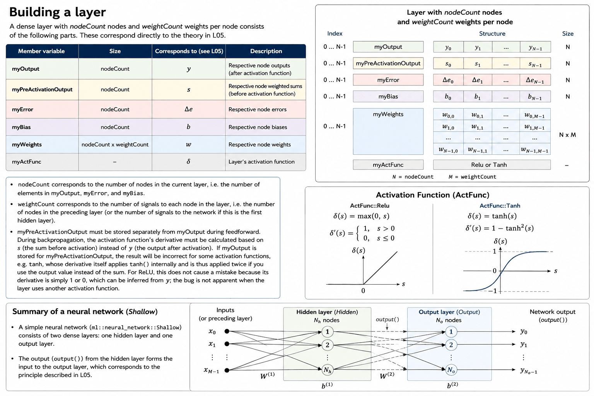
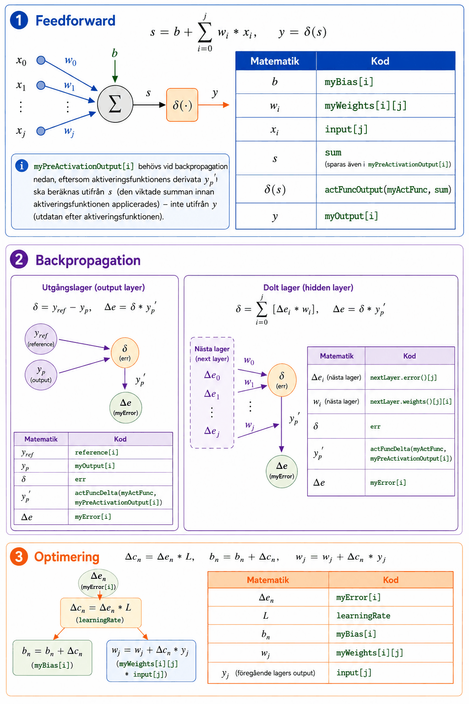

# Appendix A - Theory
This appendix covers the dense layer's architecture and how the feedforward, backpropagation, and
optimization equations from L03 map onto the code you'll write.

---

## 1. Dense Layer Architecture

### Introduction
* A **dense layer** *(fully connected layer)* is a layer in a neural network where every node receives all inputs from the previous layer.
* The class `ml::dense_layer::Dense` (see [appendix B](./b_exercises.md)) implements the interface `ml::dense_layer::Interface` and represents such a layer, whether it's used as a hidden layer or output layer in the network.

---

### Structure of a Layer
A dense layer with `nodeCount` nodes and `weightCount` weights per node consists of the parts described below. These map directly onto the theory in **L03** (see [appendix A](../../L03/appendix/a_theory.md)):

| Member variable | Size | Corresponds to (see L03) |
|---|---|---|
| `myOutput` | `nodeCount` | $y$ - each node's output (after the activation function) |
| `myPreActivationOutput` | `nodeCount` | $s$ - each node's weighted sum (before the activation function) |
| `myError` | `nodeCount` | $\Delta e$ - each node's computed error |
| `myBias` | `nodeCount` | $b$ - each node's bias |
| `myWeights` | `nodeCount` x `weightCount` | $w$ - each node's weights |
| `myActFunc` | – | $\sigma$ - the layer's activation function |

---

### Activation Function
Each layer is assigned an activation function of type `ActFunc` (`Relu` or `Tanh`) at construction. The activation function is applied to every node in the layer during feedforward (implemented later this lecture).

---

### Composing a Neural Network
A simple neural network (`ml::neural_network::Shallow`, see **L04**) consists of two dense layers: a hidden layer and an output layer, connected as shown in the figure above.

---

## 2. From Math to Code
This section summarizes how the equations for feedforward, backpropagation, and optimization from
**L03** (see [appendix A](../../L03/appendix/a_theory.md)) map onto the code you write in
`Dense` (see [appendix B](./b_exercises.md) for the full instructions).

---

### Feedforward
$$s = b + \sum_{i=0}^{j} w_i * x_i, \quad y = \sigma(s)$$

| Math | Code |
|---|---|
| $b$ | `myBias[i]` |
| $w_i$ | `myWeights[i][j]` |
| $x_i$ | `input[j]` |
| $s$ | `sum` (also stored in `myPreActivationOutput[i]`, see below) |
| $\sigma(s)$ | `actFuncOutput(myActFunc, sum)` |
| $y$ | `myOutput[i]` |

`myPreActivationOutput[i]` is needed for backpropagation below, since the activation function's
derivative $y_p'$ must be computed from $s$ (the weighted sum before the activation function was
applied), not from $y$ (the output after the activation function).

---

### Backpropagation
**Output layer:**

$$\delta = y_{ref} - y_p, \quad \Delta e = \delta * y_p'$$

| Math | Code |
|---|---|
| $y_{ref}$ | `reference[i]` |
| $y_p$ | `myOutput[i]` |
| $\delta$ | `err` |
| $y_p'$ | `actFuncDelta(myActFunc, myPreActivationOutput[i])` |
| $\Delta e$ | `myError[i]` |

**Hidden layer:**

$$\delta = \sum_{i=0}^{j} [\Delta e_i * w_i], \quad \Delta e = \delta * y_p'$$

| Math | Code |
|---|---|
| $\Delta e_i$ (next layer) | `nextLayer.error()[j]` |
| $w_i$ (next layer) | `nextLayer.weights()[j][i]` |
| $\delta$ | `err` |
| $y_p'$ | `actFuncDelta(myActFunc, myPreActivationOutput[i])` |
| $\Delta e$ | `myError[i]` |

$\Delta e$ is the gradient of the cost with respect to the node's weighted sum $s$, which is why
most literature calls it the *delta* or the *error term*. It's kept as `error()` here because
that's what the layer stores: one value per node.

It is not the same thing as the `inputGradients()` you'll meet in **L10** (see
[the flatten layer](../../L10/appendix/a_flatten_layer.md)), which holds one value per *input* and
is what a layer hands back to the layer before it. A hidden layer here fetches $\Delta e$ from its
neighbour itself with `nextLayer.error()`, so no layer ever needs to publish that second vector.

---

### Optimization
$$\Delta c_n = \Delta e_n * L, \quad b_n = b_n + \Delta c_n, \quad w_j = w_j + \Delta c_n * y_j$$

| Math | Code |
|---|---|
| $\Delta e_n$ | `myError[i]` |
| $L$ | `learningRate` |
| $b_n$ | `myBias[i]` |
| $w_j$ | `myWeights[i][j]` |
| $y_j$ (previous layer's output) | `input[j]` |

---

### Helper Functions `initRandGen()` and `randomStartVal()`
These don't correspond to any specific equation, but handle the random initialization of weights and biases described in **L03**. Both live in `ml/utils`, alongside the activation-function helpers, rather than inside the layer itself:
* `initRandGen()` ensures the random number generator (`std::rand()`) is seeded exactly once, regardless of how many layers are created. It's the same function you wrote in **L04**, which is exactly why it lives in a shared file.
* `randomStartVal()` generates the actual random number between 0.0 and 1.0 that each bias and weight value is initialized with.

---
