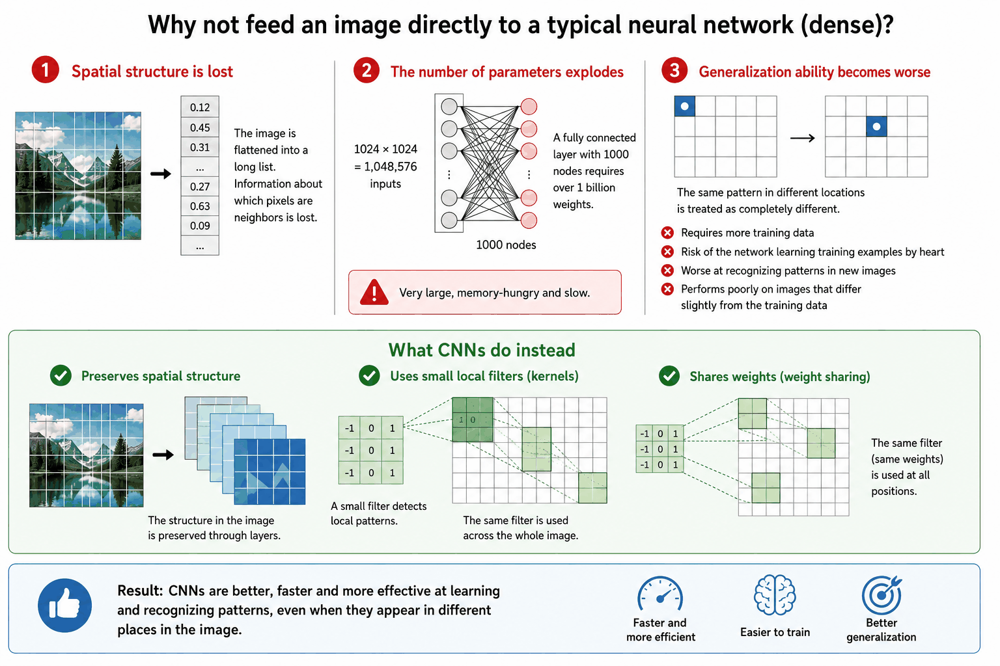
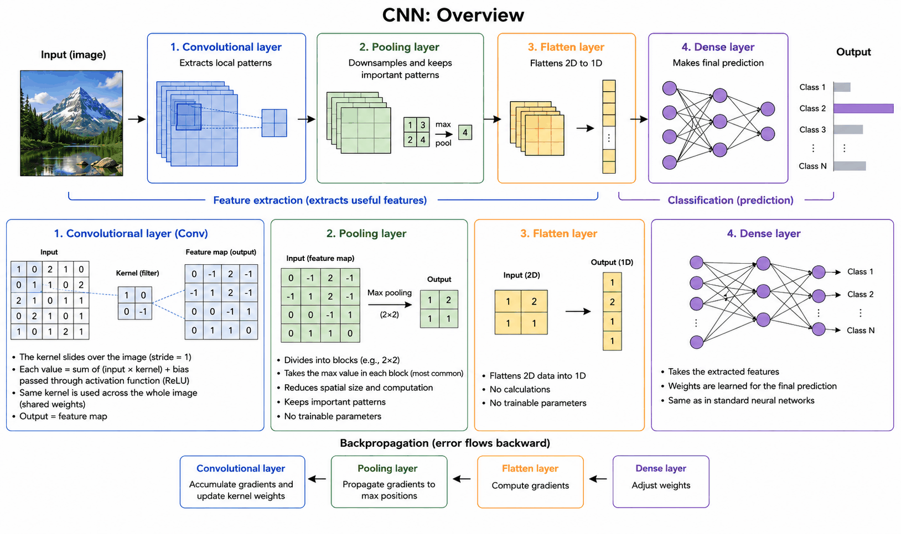

# Appendix A - Theory
This appendix covers why regular neural networks aren't well suited to image classification, and
how convolutional neural networks (CNNs) solve that problem.

---

## 1. Why Regular Neural Networks Struggle with Images

A regular neural network (consisting only of dense layers) can technically be used to process images, but in practice it rarely works well. Below we go through why, and what convolutional neural networks (CNNs) do differently.

---

### Spatial structure is lost
An image is two- or three-dimensional, but has to be flattened into a one-dimensional vector to be fed into a regular neural network, which means the information about which pixels sat next to each other is lost.

---

### The number of parameters explodes
A 1024 × 1024 pixel image requires over a billion weights already in a single hidden layer of 1000 nodes, resulting in a network that's large, memory-hungry, and slow.

---

### Generalization gets worse
Since each pixel is treated as a completely separate input, the network doesn't understand that the same pattern can appear in different places in the image, which requires more training data and results in worse generalization to new images.

---

### What CNNs do instead
Convolutional neural networks are built specifically for image data and solve this by preserving the image's spatial structure, using small local filters (kernels), and sharing the same weights across the entire image.

---

## 2. Convolutional Neural Networks (CNN)

### Overview
A typical CNN consists of four types of layers:
1. **Convolutional layers** (hereafter *conv layers*) identify and extract local patterns
   and features in an image.
2. **Pooling layers** downsample the image, reducing its size while preserving the most
   important patterns.
3. **Flatten layers** flatten the two-dimensional image into a one-dimensional representation that
   can be fed into regular neural layers.
4. **Dense layers** make the final prediction based on the extracted features.

The first three layer types extract features from the image, while the dense layer handles the
final interpretation.

---

### Convolutional Layers (Conv Layers)
A convolutional layer applies a *kernel*, a small filter of weights, across the entire
input image. The same kernel is reused at every position in the image, which keeps the number of
parameters down and lets the same pattern be recognized regardless of where in the image it
appears. Each kernel looks for a specific local pattern, for example an edge or a corner; in
practice, several kernels are often used per conv layer to capture different patterns at once,
but to keep things simple we only use a single kernel per conv layer in this course.

Two properties distinguish a conv layer from a regular dense layer:
* The computations happen locally, on a small window of the image at a time.
* The same weights (the kernel) are reused across the entire image instead of each node having its own.

Beyond that, it works exactly like a regular layer, with a weighted sum, a bias, and an
activation function (usually ReLU). The layer's output is called a *feature map*, and the process of extracting these
patterns is called *feature extraction*.

**Feedforward:** the kernel slides across the input image one step at a time (usually with `stride = 1`, i.e.
one pixel at a time). For each position:
1. A small window is selected from the image (e.g. 2×2).
2. The values are multiplied by the corresponding kernel weights.
3. The results are summed together with a bias value.
4. The activation function is applied to the result.

The value at each position in the output therefore shows how strongly the kernel reacted to that
particular spot in the image.

**Backpropagation:** just as with dense layers, the error is propagated backward through the layer to compute
gradients, i.e. how much and in which direction each weight and bias value should be adjusted.
The difference is that since the same kernel was used at every position in the image, the gradients
from all those positions must be accumulated before the kernel's weights are updated. In other
words, each kernel weight has been influenced by many different parts of the image, and
backpropagation computes the combined contribution.

**Optimization:** works identically to dense layers; each kernel weight and the bias value are adjusted in the
opposite direction of their gradient, scaled by the learning rate. The only difference is that
there are far fewer parameters involved, since a conv layer consists of just a small kernel and a
bias value rather than a unique weight per node and input.

---

### Pooling Layers
Pooling layers downsample the image so the network has less data to process, which both
simplifies training/prediction and makes the network more robust to small variations in the input.
Pooling layers have no trainable parameters at all. The input is divided into blocks (e.g. 2×2), and a
single value is picked out of each block:
* **Max pooling:** the largest value in the block. By far the most common, and what we use in this
  course.
* **Average pooling:** the average of the block.

**Feedforward:** the largest value in each pooling block is passed forward. The most prominent
features in each region are preserved, at the cost of detail; much like when an image is
downsampled: it looks largely the same, but if you enlarge it again, you can see that detail has been lost.

**Backpropagation:** the gradients are only sent back to the positions that actually held the
maximum value during feedforward; the remaining positions get a gradient of 0, since they didn't
contribute to the output.

---

### Flatten Layers
After convolution and pooling, the data is still two-dimensional, while dense layers require
one-dimensional input. The flatten layer solves this by reshaping the data from 2D to 1D. It
performs no computations and has no weights of its own; it just changes the shape of the data. During
backpropagation, it performs the corresponding operation in reverse, reshaping the gradient from 1D back to 2D.

---

### Dense Layers in a CNN
The dense layer works exactly as in a regular neural network. The only difference is that the input now
already consists of extracted, compressed features rather than raw data, and the layer weighs these
features together to make the final classification or regression.

---

### CNNs in a Nutshell
A CNN can be seen as a regular neural network with a few extra preprocessing layers specialized for spatial data:
* The conv layer looks for local patterns.
* The pooling layer keeps the most prominent ones and discards the rest.
* The flatten layer reshapes the data into a form the dense layer understands (one dimension).
* The dense layer finally performs the actual interpretation of the information.

Backpropagation follows the same chain in reverse:
* The dense layer adjusts how features are weighted.
* The flatten layer reshapes the gradients.
* The pooling layer routes the gradients to the correct positions.
* The conv layer finally adjusts the weights for the patterns that actually contributed to the prediction.

You'll see this whole pipeline wired together for the first time in L08's
[cnn_work](../../L08/cnn_work) (running on stub layers at first; the real implementations are
built into it across L08-L10), and [appendix B](./b_exercises.md) has a worked hand-training
example.

---
