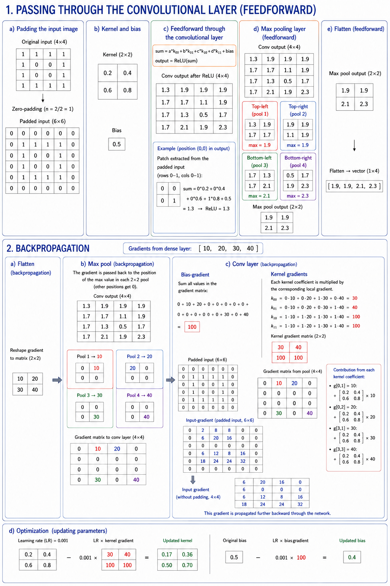

# Appendix B - Exercises

## Hand-Training a CNN
This example is worked through together during the lecture.

We have the following convolutional neural network:
* Input: **4×4**
* Conv layer:
  * Kernel: **2×2**
  * Stride = 1 *(the kernel moves one pixel at a time)*
  * Zero-padding *(we add zeros around the image so its size is preserved despite the extraction)*
  * Activation: **ReLU** *(all negative values are replaced with zero)*
  * Learning rate: **LR** = 0.001, i.e. 1 %.
* Max pool:
  * Pool size = 2
  * Stride = 2 *(the pools are non-overlapping)*
* Flatten:
  * 2×2 → 1×4

---

The figure below demonstrates the training process:



All calculations are shown below.

### 1. Passing Through the Conv Layer

#### a) Padding the input image
Assume we have the following input image, resembling the digit 0 made up of ones:

```
1 1 1 1
1 0 0 1
1 0 0 1
1 1 1 1
```

The first step is to use *zero-padding*: we add zeros around the image so its size is preserved even after the kernel filter has been applied. This way, the conv layer's output has the same dimensions as the input, **4×4** in this case.

The number of zeros `n` we add on each side is computed as:

```
n = kernel_size / 2
```

where `kernel_size` is the size of the kernel, `2` in this example, i.e. one zero on each side. The padded image then becomes **6×6**:

```
0 0 0 0 0 0
0 1 1 1 1 0
0 1 0 0 1 0
0 1 0 0 1 0
0 1 1 1 1 0
0 0 0 0 0 0
```

---

#### b) Kernel and bias
We use a kernel (a filter of weights) and a bias. Here we've chosen simple, fixed values to make the calculations easy to follow:

**Kernel weights:**

```
0.2 0.4
0.6 0.8
```

**Bias:**

```
0.5
```

---

#### c) Feedforward through the conv layer
For each position in the image, the sum of the element-wise multiplication between the kernel and the corresponding part of the image is computed, plus the bias. ReLU activation is then applied (all negative values are replaced with zero):

```
sum = a * k00 + b * k01 + c * k10 + d * k11 + bias
output = ReLU(sum)
```

where:
* **a, b, c, d** are pixel values from the current 2×2 section of the image.
* **k** stands for kernel (the filter), e.g. `k00` means the value at row 0, column 0 of the kernel matrix, i.e. the top-left corner.
* **bias** is a constant value added to the sum.

Once we've applied the kernel and bias across the entire image, we get the following conv output (4×4):

```
1.3 1.9 1.9 1.9
1.7 1.7 1.1 1.9
1.7 1.3 0.5 1.7
1.7 2.1 1.9 2.3
```

---

#### d) The max pooling layer (feedforward)
The max pooling layer looks for the largest value in each 2×2 pool (non-overlapping) from the conv layer's output. The purpose is to downsample the image: we remove detail while keeping the most important features, which reduces the amount of data and makes the model less sensitive to small variations.

We split the conv layer's output into four pools:

**Top-left corner:** max value `1.9`:

```
1.3 1.9
1.7 1.7
```

**Top-right corner:** the max value `1.9` occurs in three places; we pass forward the first
instance:

```
1.9 1.9
1.1 1.9
```

**Bottom-left corner:** max value `2.1`:

```
1.7 1.3
1.7 2.1
```

**Bottom-right corner:** max value `2.3`:

```
0.5 1.7
1.9 2.3
```

The max pooling layer's output is therefore:

```
1.9 1.9
2.1 2.3
```

---

#### e) Flatten (feedforward)
The max pooling layer's output is flattened into a vector so it can be fed to the next layer:

```
[1.9, 1.9, 2.1, 2.3]
```

---

### 2. Backpropagation
Assume the dense layer sends back the following gradients:

```
[10, 20, 30, 40]
```

---

#### a) Flatten (backpropagation)
The gradients from the dense layer are reshaped back into a matrix:

```
10 20
30 40
```

---

#### b) Max pool (backpropagation)
The gradients are propagated back to the correct positions in the max pooling layer, i.e. to the spots where the max values were located in each pool. If a pool has two max values, the gradient is propagated back to the first position; the remaining positions get a gradient of 0.

The max pooling layer's input (the same conv output as above):

```
1.3 1.9 1.9 1.9
1.7 1.7 1.1 1.9
1.7 1.3 0.5 1.7
1.7 2.1 1.9 2.3
```

**Top-left corner:** gradient `10` is propagated to the max value `1.9` (top right):

```
0 10
0  0
```

**Top-right corner:** gradient `20` is propagated to the first occurrence of the max value `1.9` (top left):

```
20  0
0  0
```

**Bottom-left corner:** gradient `30` is propagated to the max value `2.1` (bottom right):

```
0  0
0 30
```

**Bottom-right corner:** gradient `40` is propagated to the max value `2.3` (bottom right):

```
0  0
0 40
```

Assembling all the pools' gradients into a single matrix gives us:

```
0 10 20  0
0  0  0  0
0  0  0  0
0 30  0 40
```

---

#### c) Conv layer (backpropagation)
Now we compute the gradient for the bias and kernel from the error propagated back.

**Bias gradient:** the sum of all values in the gradient matrix:

```math
biasGradient = 0 + 10 + 20 + 0 + 0 + 0 + 0 + 0 + 0 + 0 + 0 + 0 + 0 + 30 + 0 + 40 = 100
```

**Kernel gradients:** for each kernel element, we sum the product of the corresponding patch in the padded input image and the gradient matrix. Most gradients are zero, so we only need to compute the four positions where the gradient is non-zero.

Padded input image (6×6):

```
0 0 0 0 0 0
0 1 1 1 1 0
0 1 0 0 1 0
0 1 0 0 1 0
0 1 1 1 1 0
0 0 0 0 0 0
```

Gradient matrix from the pooling layer (4×4):

```
0 10 20  0
0  0  0  0
0  0  0  0
0 30  0 40
```

For each position (i, j) in the gradient matrix, the corresponding 2×2 patch is extracted from the input image. Each kernel element is multiplied by the corresponding value in the patch and summed over all positions:

```math
k00 = 0 \cdot 10 + 0 \cdot 20 + 1 \cdot 30 + 0 \cdot 40 = 30
```
```math
k01 = 0 \cdot 10 + 0 \cdot 20 + 0 \cdot 30 + 1 \cdot 40 = 40
```
```math
k10 = 1 \cdot 10 + 1 \cdot 20 + 1 \cdot 30 + 1 \cdot 40 = 100
```
```math
k11 = 1 \cdot 10 + 1 \cdot 20 + 1 \cdot 30 + 1 \cdot 40 = 100
```

The kernel gradients are therefore:

```
30  40
100 100
```

**Input gradients (padded input):** we compute how the error propagates back to the input by, for each position in the gradient matrix, "spreading" the kernel's weights multiplied by the gradient value at the
right spot into a new 6×6 matrix, and summing overlapping positions.

Only four gradients are non-zero, so we only need to compute their contributions:

* From `grad[0,1] = 10`: `dX(0,1) += 2`, `dX(0,2) += 4`, `dX(1,1) += 6`, `dX(1,2) += 8`
* From `grad[0,2] = 20`: `dX(0,2) += 4`, `dX(0,3) += 8`, `dX(1,2) += 12`, `dX(1,3) += 16`
* From `grad[3,1] = 30`: `dX(3,1) += 6`, `dX(3,2) += 12`, `dX(4,1) += 18`, `dX(4,2) += 24`
* From `grad[3,3] = 40`: `dX(3,3) += 8`, `dX(3,4) += 16`, `dX(4,3) += 24`, `dX(4,4) += 32`

After summing all contributions, we get the padded input gradient matrix:

```
0  2  8  8  0  0
0  6 20 16  0  0
0  0  0  0  0  0
0  6 12  8 16  0
0 18 24 24 32  0
0  0  0  0  0  0
```

Removing the outermost row and column (padding) leaves a 4×4 matrix matching the original image; this is the gradient with respect to the input, which is passed further back through the network:

```
6  20 16  0
0   0  0  0
6  12  8 16
18 24 24 32
```

---

#### d) Optimization
Finally, we update the kernel and bias using the learning rate `LR`:

```
kernel = kernel + LR * kernelGradient
bias   = bias   + LR * biasGradient
```

**Updated kernel:**

```
0.23 0.44
0.70 0.90
```

**Updated bias:**

```
0.6
```

---
