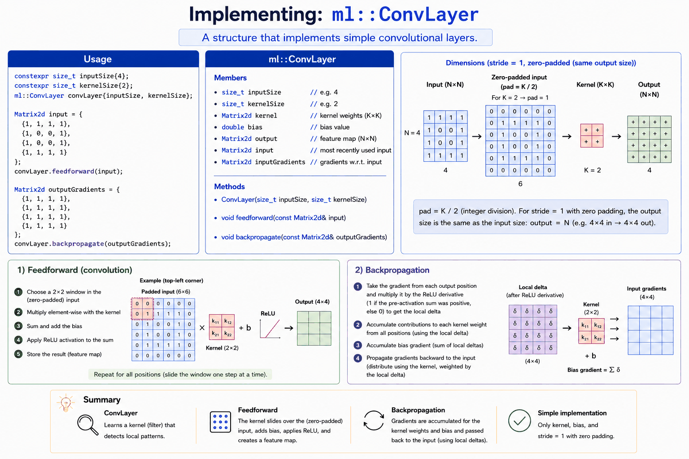

# Appendix C - Creating a Simple Conv Layer in C++

## Task description
A struct named `ml::ConvLayer` should be added to [conv_demo.cpp](../conv_layer/cpp/conv_demo.cpp) to implement a simple conv layer. To keep things as simple as possible, we implement a struct and skip get/set methods, deletion of copy and move constructors, and so on.

You don't need to finish this today: get as far as you can with `feedforward()` and
`backpropagate()`; you'll finish the struct (and compile/run it for the first time) in L07. See
[L07's appendix A](../../L07/appendix/a_conv_layer.md) for the wrap-up steps once you're done.



Note the "Dimensions" panel above: `ConvLayer` zero-pads its input (`pad = kernelSize / 2`) so the
output is the **same size as the input**, not smaller. This is why `outputGradients` in the example
below is a 4×4 matrix, matching the 4×4 `input`: your `feedforward()` and `backpropagate()` need to
pad/unpad internally (see the private methods sketched at the bottom of the struct) to make that
size match up.

The demo runs the *same* numbers you worked through by hand in
[appendix B](./b_exercises.md): the same input image, the same kernel and bias, and the same
gradients coming back from the max pooling layer. It prints each result next to the value appendix B
arrives at, so you can check your implementation against your own hand calculations rather than
guessing whether the output looks reasonable.

That's also why the kernel and bias are assigned right after the layer is created: the constructor
randomizes them, and the demo overwrites them so every run prints the same numbers.

Study the code in the `main()` function. Your implementation should be written so this code works:

```cpp
// Create a convolutional layer: 4x4 input, 2x2 kernel.
constexpr std::size_t inputSize{4U};
constexpr std::size_t kernelSize{2U};
ml::ConvLayer convLayer{inputSize, kernelSize};

// Use appendix B's kernel and bias instead of the randomized ones.
convLayer.kernel = Matrix2d{{0.2, 0.4}, {0.6, 0.8}};
convLayer.bias   = 0.5;

// Input image from appendix B, resembling the digit 0 made up of ones.
const Matrix2d input{{1, 1, 1, 1},
                     {1, 0, 0, 1},
                     {1, 0, 0, 1},
                     {1, 1, 1, 1}};

// Perform feedforward (convolution). Expect the conv output from appendix B.
convLayer.feedforward(input);

// Gradients the max pooling layer sends back in appendix B.
const Matrix2d outputGradients{{0, 10, 20, 0},
                               {0,  0,  0, 0},
                               {0,  0,  0, 0},
                               {0, 30,  0, 40}};

// Perform backpropagation. Expect the input gradients from appendix B.
convLayer.backpropagate(outputGradients);

// Perform optimization. Expect the updated kernel and bias from appendix B.
convLayer.optimize(0.001);
```

Each of `feedforward()`, `backpropagate()` and `optimize()` returns a `bool`; the demo checks it and
aborts with a message on failure.

---
