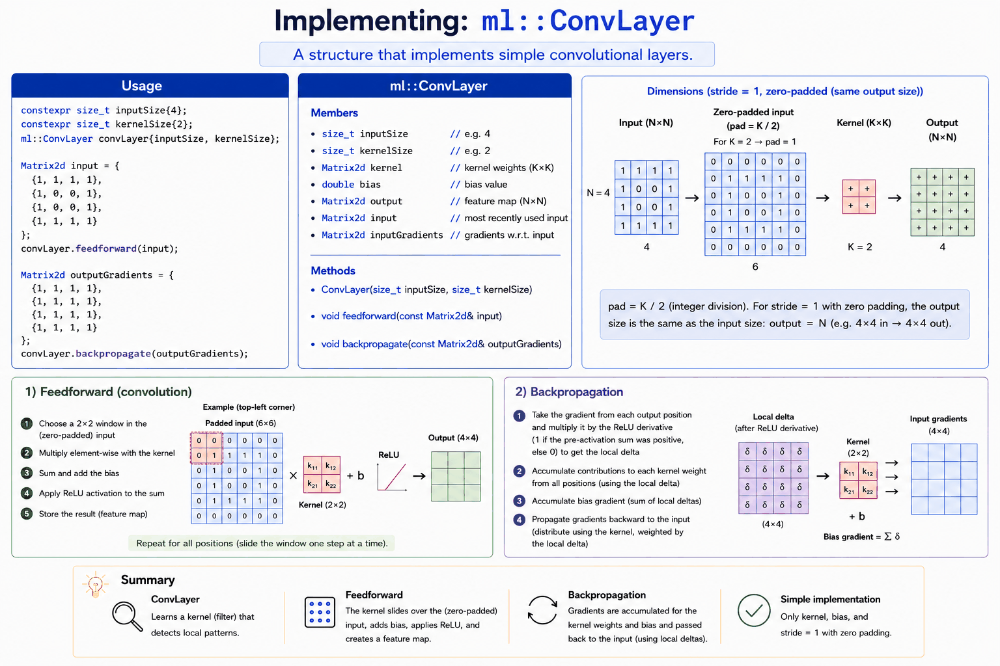

# Appendix D - Creating a Simple Conv Layer in C++

## Task description
A struct named `ml::ConvLayer` should be added to [conv_demo.cpp](../conv_layer/cpp/conv_demo.cpp) to implement a simple conv layer. To keep things as simple as possible, we implement a struct and skip get/set methods, deletion of copy and move constructors, and so on.

You don't need to finish this today: get as far as you can with `feedforward()` and
`backpropagate()`; you'll finish the struct (and compile/run it for the first time) in L07. See
[L07's appendix A](../../L07/appendix/a_conv_layer.md) for the wrap-up steps once you're done.



Note the "Dimensions" panel above: `ConvLayer` zero-pads its input (`pad = kernelSize / 2`) so the
output is the **same size as the input**, not smaller. This is why `outputGradients` in the example
below is a 4×4 matrix, matching the 4×4 `input`: your `feedforward()` and `backpropagate()` need to
pad/unpad internally (see the private methods sketched at the bottom of the struct) to make that
size match up.

Study the code in the `main()` function. Your implementation should be written so this code works:

```cpp
// Create a convolutional layer: 4x4 input, 2x2 kernel.
constexpr std::size_t inputSize{4U};
constexpr std::size_t kernelSize{2U};
ml::ConvLayer convLayer{inputSize, kernelSize};

// Example 4x4 input matrix (could represent an image or feature map).
const Matrix2d input{{1, 1, 1, 1},
                     {1, 0, 0, 1},
                     {1, 0, 0, 1},
                     {1, 1, 1, 1}};

// Perform feedforward (convolution).
convLayer.feedforward(input);

// Example output gradients (target output for demonstration).
const Matrix2d outputGradients{{1, 1, 1, 1},
                               {1, 1, 1, 1},
                               {1, 1, 1, 1},
                               {1, 1, 1, 1}};

// Perform backpropagation.
convLayer.backpropagate(outputGradients);
```

---
