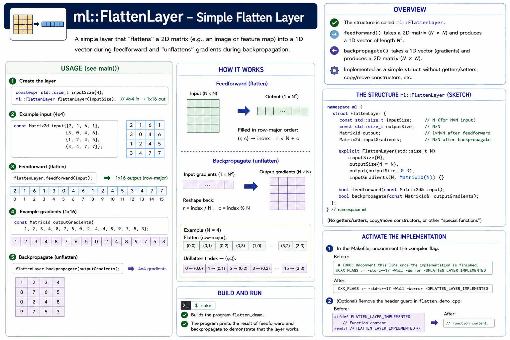

# Appendix A - Creating a Simple Flatten Layer in C++

### Task description
A struct named `ml::FlattenLayer` should be added to
[flatten_demo.cpp](../flatten_layer/cpp/flatten_demo.cpp) to implement a simple flatten layer.
To keep things as simple as possible, we implement a struct and skip get/set methods,
deletion of copy and move constructors, and so on.



Study the code in the `main()` function. Your implementation should be written so this code works to
create and use a flatten layer named `flattenLayer`:

```cpp
// Create a flatten layer: 4x4 input, produces 1x16 output.
constexpr std::size_t inputSize{4U};
ml::FlattenLayer flattenLayer{inputSize};

// Example 4x4 input matrix (could represent an image or feature map).
const Matrix2d input{{2, 1, 6, 1},
                     {3, 0, 4, 6},
                     {1, 2, 4, 5},
                     {3, 4, 7, 7}};

// Perform feedforward (flatten the input).
flattenLayer.feedforward(input);

// Example output gradients (same shape as flattened output, used for backpropagation demo).
const Matrix1d outputGradients{1, 2, 3, 4, 8, 7, 6, 5, 0, 2, 4, 8, 9, 7, 5, 3};

// Perform backpropagation (unflatten the output gradients).
flattenLayer.backpropagate(outputGradients);
```

### Compiling and running the program
As usual, the program can be run by typing the command `make` in the terminal:

```bash
make
```

Once the implementation is complete, uncomment the compiler flag `CXX_FLAGS` in
the [Makefile](../flatten_layer/cpp/Makefile). That is, change the following:

```bash
# TODO: Uncomment this line once the implementation is finished.
#CXX_FLAGS := -std=c++17 -Wall -Werror -DFLATTEN_LAYER_IMPLEMENTED
```

to

```bash
CXX_FLAGS := -std=c++17 -Wall -Werror -DFLATTEN_LAYER_IMPLEMENTED
```

You can then also remove the header guard `FLATTEN_LAYER_IMPLEMENTED` from
[flatten_demo.cpp](../flatten_layer/cpp/flatten_demo.cpp) if you like. In that case, change the
following:

```cpp
/**
 * @brief Create and demonstrate a simple flatten layer.
 * 
 * @return 0 on success, -1 on failure.
 */
int main()
{
//! @todo Remove this header guard (and/or uncomment the compiler flags in the makefile) once the
//        implementation is finished.
#ifdef FLATTEN_LAYER_IMPLEMENTED
    // Function content.
    return 0;

//! @todo Remove this header guard (and/or uncomment the compiler flags in the makefile) once the
//        implementation is finished.
#endif /** FLATTEN_LAYER_IMPLEMENTED */
}
```

to

```cpp
/**
 * @brief Create and demonstrate a simple flatten layer.
 * 
 * @return 0 on success, -1 on failure.
 */
int main()
{
    // Function content.
    return 0;
}
```

---
